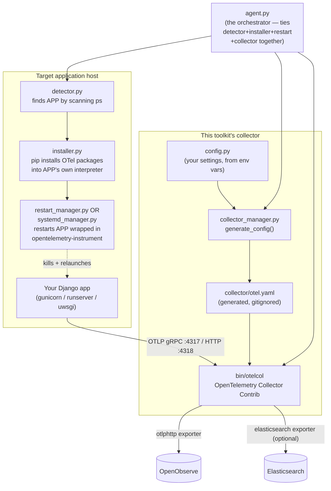

# Infraon Agent — a tutorial copy

> This folder is a sanitized, standalone copy of Infraon's `infraon-apm-agent/`
> toolkit, made for learning how it works. Every real credential from the
> original has been stripped and replaced with environment-variable-driven
> placeholders — see **Security** below before you point this at anything
> real.
>
> Source of truth for the production deployment of this toolkit lives in the
> `Infraon` monorepo at `infraon-apm-agent/` (git-ignored there) and is
> documented in `docs/apm-opentelemetry-openobserve.md`, section 6. This copy
> exists purely so the code and its behaviour can be read, run, and broken
> safely, away from any real system.

---

## Table of contents

1. [What this is, in one page](#1-what-this-is-in-one-page)
2. [Concepts: OpenTelemetry in 5 minutes](#2-concepts-opentelemetry-in-5-minutes)
3. [Architecture](#3-architecture)
4. [Directory layout](#4-directory-layout)
5. [Every file, explained in full](#5-every-file-explained-in-full)
6. [Configuration reference](#6-configuration-reference)
7. [Quickstart](#7-quickstart)
8. [The two ways to run this](#8-the-two-ways-to-run-this)
9. [Windows caveats](#9-windows-caveats)
10. [Verifying it actually works](#10-verifying-it-actually-works)
11. [Troubleshooting](#11-troubleshooting)
12. [Known risks and limitations (read before using for real)](#12-known-risks-and-limitations-read-before-using-for-real)
13. [Security](#13-security)
14. [Glossary](#14-glossary)

---

## 1. What this is, in one page

**Infraon Agent** is a small Python toolkit with one job: make an *already
running* Python web application (Django, by name, though the idea
generalizes) start emitting OpenTelemetry traces, **without you having to
change that application's code or restart it by hand**. It does this by:

1. Finding the running process (`detector.py`).
2. Installing the OpenTelemetry packages into that process's own Python
   environment (`installer.py`).
3. Starting a local **OpenTelemetry Collector** — a separate process that
   receives traces over the network and forwards them to real storage
   (`collector_manager.py` + the `bin/otelcol` binary).
4. Restarting the target process wrapped in the `opentelemetry-instrument`
   launcher, either directly (`restart_manager.py`, for a plain process) or
   by patching its systemd unit (`systemd_manager.py`, for a service).

**This toolkit genuinely has two separate halves, and it's important to keep
them apart in your head:**

| Half | Files | What it does | How "safe" it is |
|---|---|---|---|
| **The collector** | `config.py`, `collector_manager.py`, `bin/otelcol` | Builds a YAML config and starts the OpenTelemetry Collector binary. Purely additive — it just listens on two ports and forwards whatever it receives. | Safe to run repeatedly. Doesn't touch any other process. |
| **The self-instrumentation installer** | `agent.py`, `detector.py`, `installer.py`, `injector.py`, `restart_manager.py`, `systemd_manager.py` | Scans *every running process on the machine*, finds one that looks like a Django/gunicorn/uwsgi app, `pip install`s packages into its interpreter, then **kills and restarts that process** (or rewrites its systemd unit and restarts the service). | **Not safe to run blindly.** It identifies its target by matching a substring in the process command line (`"gunicorn"`, `"manage.py"`, `"uwsgi"`) — on a machine with more than one such process, or a wrapper script that happens to contain one of those substrings, it can restart the wrong thing. See [section 12](#12-known-risks-and-limitations-read-before-using-for-real). |

In the real Infraon deployment this toolkit came from, **only the collector
half is actually used in production** — it runs as a systemd service with a
hand-written config. The self-instrumentation half (`agent.py` and its
dependencies) exists as a one-shot tool meant to be copied onto a *new*
target host and run there once, but as of this writing it had never actually
been exercised against a real process anywhere. You are, in a sense, looking
at code that is more tested by reading than by running — treat it
accordingly.

---

## 2. Concepts: OpenTelemetry in 5 minutes

If you already know what a trace, span, and the OTLP protocol are, skip to
[section 3](#3-architecture).

- **Span** — one timed unit of work: one HTTP request, one database query,
  one function call you chose to instrument. It has a name, a start time, a
  duration, a status (OK/ERROR), and key/value **attributes** (e.g.
  `http.method = GET`).
- **Trace** — every span that belongs to one logical operation (e.g. "handle
  this HTTP request, including every DB query it made"), linked by a shared
  `trace_id`.
- **Parent/child** — a span can point at the span that caused it
  (`parent_span_id`). A request handler span is the parent of the DB query
  spans it triggers.
- **Instrumentation** — code that automatically wraps a library (Django,
  psycopg2, requests, ...) so every call through it produces a span, with no
  changes to your application code. `opentelemetry-instrument
  <your-command>` is a launcher that installs this automatic instrumentation
  before your app's own code starts running.
- **Exporter** — the piece of the OpenTelemetry SDK that batches finished
  spans and sends them somewhere, over the **OTLP** protocol (OpenTelemetry's
  own wire format, available over gRPC or HTTP).
- **Collector** — a standalone process that *receives* OTLP data and
  forwards it to one or more real backends (Elasticsearch, OpenObserve,
  Jaeger, anything with an OTLP-compatible receiver). Using a collector
  means your application only ever needs to know one address (the
  collector's), and where the data actually ends up becomes a config change,
  not a code change.

This toolkit's job, end to end:

```
your app's own code
      │  (no changes needed)
      ▼
opentelemetry-instrument <your app's start command>
      │  auto-instruments Django/psycopg2/etc., creates spans
      ▼
OTLP over gRPC (port 4317) or HTTP (port 4318)
      ▼
the collector (bin/otelcol, config from collector_manager.py)
      │  batches, then forwards
      ▼
Elasticsearch and/or OpenObserve
```

---

## 3. Architecture



---

## 4. Directory layout

```
infraon-apm-agent/
├── agent.py                 entry point — runs the whole self-instrumentation flow
├── detector.py               finds a running Django/gunicorn/uwsgi process
├── installer.py               pip-installs OTel packages into that process's interpreter
├── injector.py                 builds the env vars for a non-systemd restart
├── restart_manager.py          kills + relaunches a plain (non-systemd) process
├── systemd_manager.py          patches + restarts a systemd-managed service
├── collector_manager.py        generates collector/otel.yaml, starts bin/otelcol
├── config.py                  your settings (reads from environment variables)
├── requirements.txt            this toolkit's OWN deps (psutil, requests)
├── bin/
│   └── otelcol                the OpenTelemetry Collector Contrib binary (Linux)
├── collector/
│   └── otel.yaml               generated config — created by setup.sh/.ps1, gitignored
├── logs/                      agent.log would go here (path from config.py)
├── setup.sh                   Linux / macOS / WSL setup script
├── setup.ps1                   Windows setup script
├── .env.example                template for your real secrets
├── .gitignore
└── README.md                   this file
```

---

## 5. Every file, explained in full

### `config.py`

A single dict, `CONFIG`, that every other file imports and reads from. In
this tutorial copy, every value is sourced from an environment variable via
a small `_env()` / `_env_bool()` helper, with a placeholder default — **this
is a deliberate change from the original**, which hardcoded real passwords
directly in this file. See [section 13](#13-security).

| Key | Meaning |
|---|---|
| `service_name` | What the instrumented app calls itself in traces (`OTEL_SERVICE_NAME`). |
| `otel_endpoint` | Where the *application's* OTel SDK sends traces — i.e. the collector's gRPC address. |
| `enable_elasticsearch` / `elasticsearch_url` / `es_username` / `es_password` | Optional second export target. |
| `enable_openobserve` / `openobserve_url` / `oo_org` / `oo_trace_stream` / `oo_log_stream` / `oo_username` / `oo_password` | The primary export target. `oo_org` must be an OpenObserve organization your `oo_username` actually belongs to — a mismatch here doesn't error loudly, it just silently fails to ingest (see [section 11](#11-troubleshooting)). |
| `log_file` | Where `agent.py` would log to (the log file itself is not implemented in this version — the key exists but nothing currently writes to it; this is a known gap, not a bug you introduced). |

### `detector.py`

```python
def detect_runtime():
    for proc in psutil.process_iter(['pid', 'cmdline']):
        cmd = proc.info['cmdline'] or []
        cmd_str = " ".join(cmd)
        if "gunicorn" in cmd_str: return ("gunicorn", proc, cmd)
        elif "manage.py" in cmd_str: return ("runserver", proc, cmd)
        elif "uwsgi" in cmd_str: return ("uwsgi", proc, cmd)
    return (None, None, None)
```

Walks every process on the machine (`psutil.process_iter`) and returns the
**first** one whose full command line contains `"gunicorn"`, `"manage.py"`,
or `"uwsgi"`, in that priority order. This is a substring match on the
*entire* command line, not an exact binary name match — a process started
as `/opt/myapp/run-manage.py-wrapper.sh` would also match `"manage.py"`.
That's the mechanism behind the risk noted in [section 12](#12-known-risks-and-limitations-read-before-using-for-real).

`get_python_path(cmd)` just returns `cmd[0]` — the assumption is that the
first token of the command line is the interpreter path (true for
`python manage.py runserver`, not necessarily true for every possible way of
launching gunicorn/uwsgi).

`is_systemd(proc)` reads `/proc/<pid>/cgroup` and checks whether
`"system.slice"` appears in it — the standard cgroup slice systemd-managed
services run under on a modern Linux host. This only works on Linux.

### `installer.py`

```python
def install_dependencies(python_path):
    packages = [
        "opentelemetry-distro",
        "opentelemetry-exporter-otlp",
        "opentelemetry-instrumentation-django",
        "opentelemetry-instrumentation-psycopg2",
    ]
    subprocess.run([python_path, "-m", "pip", "install"] + packages)
```

Runs `pip install` for exactly four packages, using the **target process's
own interpreter path** (not this toolkit's venv) — so the instrumentation
ends up available to the app that needs it, not just to this script. Notes:

- No version pins — re-running this months later can silently pull a
  different, possibly incompatible, set of package versions than whatever
  was tested.
- Only Django and psycopg2 get instrumented. If the target app also uses
  Mongo, Redis, or raw `requests` calls, those won't produce spans — you'd
  need to extend this list (see `infraon_otel_bootstrap.py` in the main
  Infraon repo for a worked example with pymongo/psycopg/redis/requests all
  instrumented and in the correct order).

### `injector.py`

```python
def build_env(config):
    env = os.environ.copy()
    env["OTEL_SERVICE_NAME"] = config["service_name"]
    env["OTEL_EXPORTER_OTLP_ENDPOINT"] = config["otel_endpoint"]
    env["OTEL_TRACES_EXPORTER"] = "otlp"
    return env
```

Builds the environment dict that gets passed to the restarted process — a
copy of the *current* process's environment (i.e. this script's own), with
three OTel variables layered on top. Used only by `restart_manager.py` (the
non-systemd path); `systemd_manager.py` takes a different approach (writing
`Environment=` is not done here — see below, that's actually a gap in the
systemd path worth noting).

### `restart_manager.py`

The non-systemd restart path — used when `detector.is_systemd()` returns
`False`. Step by step:

1. `find_django_path(cmd)` / `get_safe_cwd(proc, cmd)` work out a working
   directory to relaunch the process from: first try the live process's own
   `cwd()`, then look for a `manage.py` argument in its command line, then
   fall back to this script's own current directory.
2. `proc.send_signal(signal.SIGTERM)` — asks the process to shut down
   gracefully, waits up to 10 seconds (`proc.wait(timeout=10)`), and
   force-`kill()`s it if that times out.
3. Builds `new_cmd = ["opentelemetry-instrument"] + cmd` — i.e. the exact
   same command line as before, just prefixed with the instrumentation
   launcher.
4. `subprocess.Popen(new_cmd, env=env, cwd=cwd, ...)` starts it again.
5. Sleeps 3 seconds, then checks `new_proc.poll()` — if the process has
   already exited, it prints stdout/stderr and reports failure instead of
   silently leaving the app down.

This is genuinely careful about verifying the restart succeeded. It is
**not** careful about verifying it killed the *right* process — that
decision was already made, unverified, back in `detector.py`.

### `systemd_manager.py`

The systemd restart path. `detect_service_name(proc)` reads
`/proc/<pid>/cgroup` and extracts whatever precedes `.service` in the cgroup
path. `patch_service(service_name, cmd)` then:

1. Builds `new_cmd = "opentelemetry-instrument " + " ".join(cmd)`.
2. Writes a systemd **drop-in override** to
   `/etc/systemd/system/<service_name>.d/override.conf`:
   ```ini
   [Service]
   ExecStart=
   ExecStart=<new_cmd>
   ```
   (The empty `ExecStart=` first clears the unit's original command — a
   required systemd idiom, since `ExecStart=` is otherwise additive.)
3. Runs `systemctl daemon-reexec`, `systemctl daemon-reload`, then
   `systemctl restart <service_name>`.

Two things worth knowing if you ever run this for real:

- It **unconditionally overwrites** `override.conf` — running it twice
  wraps `opentelemetry-instrument` around a command that may already be
  wrapped, silently double-instrumenting.
- `daemon-reexec` re-executes systemd's own PID 1 and reloads *all* unit
  state on the host, not just this one service — a broader blast radius
  than this single-service change strictly needs. `daemon-reload` alone is
  usually sufficient for a drop-in file change.

### `collector_manager.py`

The safe half. `generate_config(config)` builds `collector/otel.yaml` by
hand (string templating, not a YAML library) from the `CONFIG` dict:

- Always listens for OTLP on gRPC `:4317` and HTTP `:4318`, with CORS
  enabled for `localhost:4300` / `127.0.0.1:4300` (the ports/origins this
  toolkit's upstream project uses for its own local dev UI — change these
  in the template if yours differs).
- Conditionally includes an `elasticsearch` exporter block if
  `enable_elasticsearch` is true, Basic-Auth-encoding `es_username:es_password`.
- Conditionally includes **two** `otlphttp` exporter instances pointed at
  the same OpenObserve endpoint but different `stream-name` headers — one
  for traces, one for logs. This mirrors how OpenObserve itself routes
  ingested data: by an HTTP header, not by the OTLP signal type.
- `telemetry.metrics.level: none` turns off the collector's *own*
  self-monitoring metrics endpoint — without this, running two collector
  instances on one host clashes over port 8888.

`start_collector()` just does `subprocess.Popen(["./bin/otelcol", "--config",
"collector/otel.yaml"], stdout=DEVNULL, stderr=DEVNULL)` — fire and forget,
with every log line discarded. `setup.sh`/`setup.ps1` in this tutorial run
the binary directly instead, so you can see what it's doing.

### `agent.py`

The orchestrator. Ten lines of actual logic:

```python
runtime, proc, cmd = detect_runtime()
if not runtime: return
python_path = get_python_path(cmd)
install_dependencies(python_path)
generate_config(CONFIG)
start_collector()
if is_systemd(proc):
    service_name = detect_service_name(proc)
    if service_name: patch_service(service_name, cmd)
else:
    env = build_env(CONFIG)
    restart_process(proc, cmd, env)
```

Running `python agent.py` on a host performs the **entire** chain: detect →
install packages → generate+start the collector → restart the target
process (systemd-patched or direct, whichever applies) — all in one
unattended run. See [section 8](#8-the-two-ways-to-run-this) for how to run
this deliberately and safely.

### `requirements.txt`

```
psutil
requests
```

This toolkit's **own** runtime dependencies (used by `detector.py` and
reserved for future HTTP calls respectively) — separate from the four
OpenTelemetry packages `installer.py` installs into the *target* app.

### `bin/otelcol`

The actual [OpenTelemetry Collector
Contrib](https://github.com/open-telemetry/opentelemetry-collector-releases)
binary, build v0.147.0, statically linked, **Linux x86-64 only** (confirmed
via its ELF header — see [section 9](#9-windows-caveats) for what that means
on Windows). This is the component that actually receives and forwards
telemetry; everything else in this repo exists to configure and launch it.

> **Not in this git repo.** At 342MB, this single binary is larger than
> GitHub's 100MB hard limit for a normal push, so it is listed in
> `.gitignore` and was never committed. Get it yourself, once, before first
> use:
>
> **Linux / macOS / WSL:**
> ```bash
> curl -L -o bin/otelcol.tar.gz \
>   https://github.com/open-telemetry/opentelemetry-collector-releases/releases/download/v0.147.0/otelcol-contrib_0.147.0_linux_amd64.tar.gz
> tar -xzf bin/otelcol.tar.gz -C bin otelcol-contrib
> mv bin/otelcol-contrib bin/otelcol
> chmod +x bin/otelcol
> rm bin/otelcol.tar.gz
> ```
> **Windows:** just run `.\setup.ps1` — it downloads the matching Windows
> build (`bin\otelcol.exe`) automatically (see [section 9](#9-windows-caveats)).
>
> Any recent OpenTelemetry Collector Contrib release works; pin to v0.147.0
> only if you specifically want to match what this tutorial was tested
> against — check the [releases page](https://github.com/open-telemetry/opentelemetry-collector-releases/releases)
> for current builds.

---

## 6. Configuration reference

All of these are environment variables, read by `config.py`. Set them in a
`.env` file (copy `.env.example`) or export them in your shell before
running the setup scripts.

| Variable | Default | Required for a real run? |
|---|---|---|
| `OTEL_SERVICE_NAME` | `django-app` | No — cosmetic, but set it to something meaningful |
| `OTEL_ENDPOINT` | `http://localhost:4317` | No, unless the collector runs elsewhere |
| `ENABLE_ELASTICSEARCH` | `false` | No |
| `ELASTICSEARCH_URL` | `http://localhost:9200` | Only if `ENABLE_ELASTICSEARCH=true` |
| `ES_USERNAME` | `elastic` | Only if `ENABLE_ELASTICSEARCH=true` |
| `ES_PASSWORD` | `CHANGE_ME_ES_PASSWORD` | **Yes**, if `ENABLE_ELASTICSEARCH=true` |
| `ENABLE_OPENOBSERVE` | `true` | — |
| `OPENOBSERVE_URL` | `http://localhost:5080` | **Yes** |
| `OO_ORG` | `default` | **Yes** — must be an org your user belongs to |
| `OO_TRACE_STREAM` | `apm_traces` | No |
| `OO_LOG_STREAM` | `apm_logs` | No |
| `OO_USERNAME` | `admin@example.com` | **Yes** |
| `OO_PASSWORD` | `CHANGE_ME_OO_PASSWORD` | **Yes** |
| `LOG_FILE` | `logs/agent.log` | No (unused by current code, see `config.py` notes) |

---

## 7. Quickstart

**Linux / macOS / WSL:**

```bash
cd infraon-apm-agent
cp .env.example .env        # then edit .env with real values
chmod +x setup.sh
./setup.sh                  # installs deps, generates collector/otel.yaml
./setup.sh --start          # ...or do both in one step
```

**Windows (PowerShell):**

```powershell
cd infraon-apm-agent
Copy-Item .env.example .env   # then edit .env with real values
.\setup.ps1
.\setup.ps1 -Start            # ...or do both in one step
```

Either script leaves you with an activated understanding of three things:
a `venv/` with every dependency installed, a generated `collector/otel.yaml`
you can read and sanity-check, and (unless something failed) a collector
binary ready to run.

---

## 8. The two ways to run this

### A. Just the collector (safe, recommended starting point)

This is everything `setup.sh`/`setup.ps1` do by default. It stands up a
local OpenTelemetry Collector that listens for OTLP traffic and forwards it
to OpenObserve/Elasticsearch — nothing else on the machine is touched. Point
*any* OTel SDK at `http://localhost:4317` (gRPC) or `:4318` (HTTP) to test
it — it doesn't have to be a Django app; any language's OTel SDK speaks the
same OTLP protocol.

```bash
./bin/otelcol --config collector/otel.yaml          # Linux/macOS/WSL
.\bin\otelcol.exe --config collector\otel.yaml       # Windows, after setup.ps1 downloaded it
```

### B. The full self-instrumentation flow (do this deliberately, never blindly)

This is what `python agent.py` runs. **Read [section 12](#12-known-risks-and-limitations-read-before-using-for-real)
first.** Recommended precautions before you try it, even against a
disposable test app:

1. Make sure there's exactly **one** process on the machine matching
   `"gunicorn"`, `"manage.py"`, or `"uwsgi"` — `ps aux | grep -E
   "gunicorn|manage.py|uwsgi"` (Linux/macOS) or `Get-Process | Where-Object
   {$_.CommandLine -match "manage.py"}` (Windows, if you're experimenting
   under WSL-launched Python) — so `detector.py` can't possibly pick the
   wrong one.
2. Activate this toolkit's venv (`source venv/bin/activate` or
   `.\venv\Scripts\Activate.ps1`) so `agent.py` sees `psutil`.
3. Run it: `python agent.py`
4. Watch its output. It prints each step (`"No Django detected"`,
   `"Tracing enabled"`) and, via `restart_manager.py`, the target process's
   own stdout/stderr if the restart fails.

This path is Linux-oriented throughout (`/proc/<pid>/cgroup`,
`systemctl`, POSIX signals) — see the next section.

---

## 9. Windows caveats

This toolkit, as shipped, assumes Linux:

- **`bin/otelcol` is a Linux ELF binary.** It will not execute on Windows.
  `setup.ps1` downloads a genuine Windows build of the same collector
  version to `bin\otelcol.exe` automatically; pass `-SkipCollectorDownload`
  if you'd rather run the original binary under WSL instead
  (`wsl ./bin/otelcol --config collector/otel.yaml`).
- **`detector.is_systemd()`** reads `/proc/<pid>/cgroup`, which doesn't
  exist on Windows — it will always return `False` there (caught by a bare
  `except:`), so the self-instrumentation flow would always take the
  `restart_manager.py` path, never `systemd_manager.py`. That's harmless
  (Windows doesn't have systemd anyway) but worth knowing.
- **`restart_manager.py`'s `signal.SIGTERM`** works differently on Windows —
  `psutil`'s `send_signal(SIGTERM)` maps it to `TerminateProcess`, which is
  an immediate hard kill, not the graceful shutdown request it is on Linux.
  If you experiment with the full flow on Windows, expect no graceful
  shutdown window.
- **`opentelemetry-instrument`** itself (the launcher these scripts wrap
  target commands in) works fine on Windows — it's a pure Python entry
  point installed by `opentelemetry-distro`.

Given all that, the honest recommendation is: use Windows (via `setup.ps1`)
to run **just the collector** ([section 8A](#8-the-two-ways-to-run-this)),
and do any experimentation with the full self-instrumentation flow
([section 8B](#8-the-two-ways-to-run-this)) inside WSL or a Linux VM, where
the code's assumptions actually hold.

---

## 10. Verifying it actually works

**1. Is the collector listening?**

```bash
curl -i -X OPTIONS http://localhost:4318/v1/traces \
  -H "Origin: http://localhost:4300" \
  -H "Access-Control-Request-Method: POST"
# expect: HTTP 204
```

**2. Send it a dummy span by hand** (no app needed — proves the collector →
backend leg works independently of any instrumented application):

```bash
python3 - <<'EOF'
import time, uuid, requests
now = time.time_ns()
body = {
    "resourceSpans": [{
        "resource": {"attributes": [{"key": "service.name", "value": {"stringValue": "manual-test"}}]},
        "scopeSpans": [{
            "scope": {"name": "manual-test"},
            "spans": [{
                "traceId": uuid.uuid4().hex, "spanId": uuid.uuid4().hex[:16],
                "name": "manual-test-span", "kind": 1,
                "startTimeUnixNano": str(now), "endTimeUnixNano": str(now + 1_000_000),
            }],
        }],
    }],
}
r = requests.post("http://localhost:4318/v1/traces", json=body, timeout=10)
print(r.status_code, r.text)
EOF
# expect: 200 {"partialSuccess":{}} (or similar)
```

**3. Confirm it arrived at the backend.** For OpenObserve, query its search
API for the `manual-test` service (replace host/org/credentials with your
own — see [section 6](#6-configuration-reference)):

```bash
curl -s -u "$OO_USERNAME:$OO_PASSWORD" \
  -X POST "$OPENOBSERVE_URL/api/$OO_ORG/_search?type=traces" \
  -H "Content-Type: application/json" \
  -d '{"query":{"sql":"SELECT service_name, count(*) c FROM \"apm_traces\" WHERE service_name = '"'"'manual-test'"'"' GROUP BY service_name","start_time":0,"end_time":9999999999999999,"from":0,"size":10}}'
```

Allow a short delay — ingestion-to-searchable latency of roughly a minute is
normal for OpenObserve under light load.

---

## 11. Troubleshooting

| Symptom | Likely cause | Fix |
|---|---|---|
| `curl` to `:4318` times out / connection refused | Collector isn't running, or a firewall is blocking the port | Confirm the process is up (`ps aux \| grep otelcol`); open 4317/4318 |
| Collector starts, then immediately exits, log mentions port 8888 | Another collector (or anything else) already bound the metrics port | Keep `telemetry.metrics.level: none` in the generated config — don't remove it |
| Browser preflight to the collector fails (CORS) | Your frontend's origin isn't in the `cors.allowed_origins` list in `collector/otel.yaml` | Edit the generated YAML, or extend `collector_manager.py`'s template, to add your origin |
| Spans accepted (HTTP 200) but never show up in OpenObserve searches | `OO_ORG` isn't an org your `OO_USERNAME` is actually a member of | OpenObserve returns 401 for a tenant you're not in, and the exporter treats 401 as non-retriable and silently drops the batch — fix `OO_ORG`, don't just retry |
| `ModuleNotFoundError: No module named 'psutil'` when running `agent.py` directly | You ran `python agent.py` without activating this toolkit's venv | `source venv/bin/activate` (or `.\venv\Scripts\Activate.ps1`) first |
| `detector.py` never finds your app | Your start command contains none of `gunicorn` / `manage.py` / `uwsgi` literally | This detector is intentionally minimal — extend the substring list in `detect_runtime()` for your own stack |
| On Windows, `.\bin\otelcol.exe` doesn't exist after `setup.ps1` | The automatic download failed (no network, GitHub unreachable, etc.) | Download it yourself from the [releases page](https://github.com/open-telemetry/opentelemetry-collector-releases/releases) and save it to `bin\otelcol.exe`, or run the Linux binary under WSL |

---

## 12. Known risks and limitations (read before using for real)

These are inherited, as-is, from the original toolkit. None of them were
introduced by this tutorial copy, and none have been fixed here — they're
listed so you understand exactly what you'd be relying on if you ever ran
the self-instrumentation half ([section 8B](#8-the-two-ways-to-run-this))
against something that matters:

1. **Target selection is a substring match, not an identity check.**
   `detector.py` restarts the *first* process whose command line contains
   `"gunicorn"`, `"manage.py"`, or `"uwsgi"`. On a host with more than one
   such process, or a wrapper script whose path happens to contain one of
   those substrings, this can target the wrong process.
2. **Failures are swallowed silently in several places.**
   `detector.is_systemd()`, `systemd_manager.detect_service_name()`, and
   `restart_manager.get_safe_cwd()` all use a bare `except:` — an error
   there falls through to the next fallback without surfacing what actually
   went wrong, which can produce a confusing wrong-but-not-crashing result
   instead of a clear error.
3. **No version pinning.** `installer.py`'s `pip install` has no version
   constraints — re-running this months apart can install a different
   OpenTelemetry package set than whatever was last tested, with no
   warning.
4. **Not idempotent.** Running `agent.py` twice against an
   already-instrumented process wraps `opentelemetry-instrument` around a
   command that's already wrapped. `systemd_manager.patch_service()`
   unconditionally overwrites its drop-in file rather than checking whether
   one already exists.
5. **`daemon-reexec`'s blast radius.** `systemd_manager.py` calls
   `systemctl daemon-reexec` in addition to `daemon-reload` — the former
   re-executes systemd's own PID 1 and reloads state for *every* unit on
   the host, which is broader than a single drop-in file change needs.
6. **Windows signal semantics differ**, as covered in
   [section 9](#9-windows-caveats).

None of this makes the toolkit unusable — it makes it something to run
**on purpose, with your eyes open**, not something to wire into an
unattended pipeline as-is.

---

## 13. Security

- **The version of this toolkit this copy was made from had a real
  OpenObserve password hardcoded in plaintext**, both directly in `config.py`
  and (base64-encoded, which is encoding, not encryption) in the generated
  `collector/otel.yaml`. **This tutorial copy's `config.py` has been
  rewritten to read every secret from an environment variable instead**, with
  a `CHANGE_ME_...` placeholder default — see the warning at the top of
  `config.py` itself.
- Never type a real password directly back into `config.py`. Use `.env`
  (gitignored) or your shell environment.
- `collector/otel.yaml` is a **generated artifact** containing your
  credentials in base64 (which, again, is not encryption — anyone who can
  read the file can trivially decode it). It is listed in `.gitignore` for
  exactly this reason. Don't commit it, don't paste it into a chat or a
  ticket without redacting the `Authorization` headers.
- If you're the person who finds a real credential sitting in a config file
  anywhere (this project or otherwise), the correct next step is to rotate
  it, not just remove it from the file — assume anything that was ever
  committed to version control, even briefly, has leaked.

---

## 14. Glossary

| Term | Meaning |
|---|---|
| OTLP | OpenTelemetry Protocol — the wire format SDKs and collectors use to exchange traces/logs/metrics, over gRPC or HTTP |
| Span | One timed unit of work within a trace |
| Trace | A tree of spans sharing one `trace_id`, representing one logical operation end-to-end |
| Collector | A standalone process that receives telemetry and forwards it to one or more backends |
| Exporter | The part of the OTel SDK (or collector) that sends data to a specific backend |
| Instrumentation | Code that auto-generates spans for a library's calls, without changing that library's own code |
| `opentelemetry-instrument` | A CLI launcher, installed by `opentelemetry-distro`, that sets up auto-instrumentation before running the command you give it |
| Systemd drop-in | A small override file under `/etc/systemd/system/<unit>.d/` that layers extra config onto a unit without editing the unit file itself |
