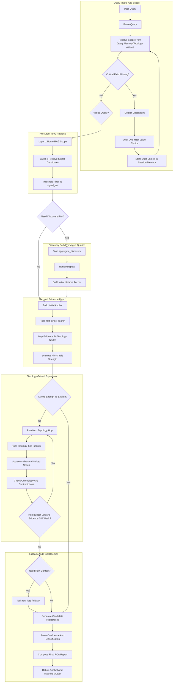
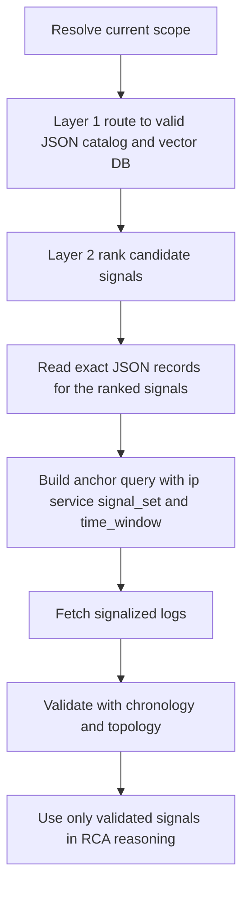
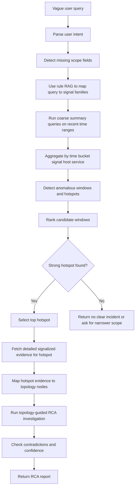
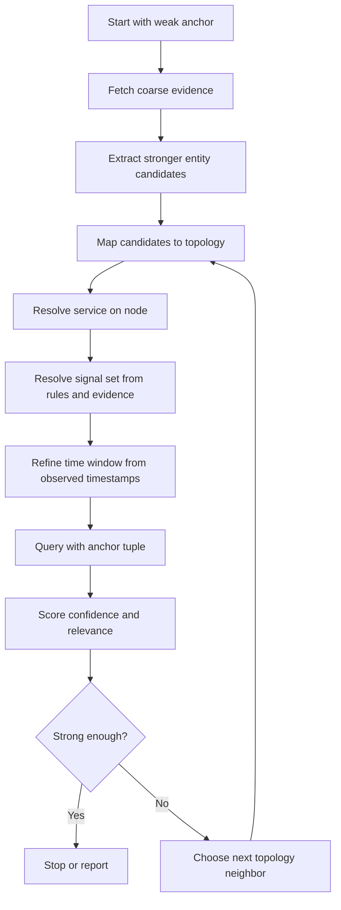
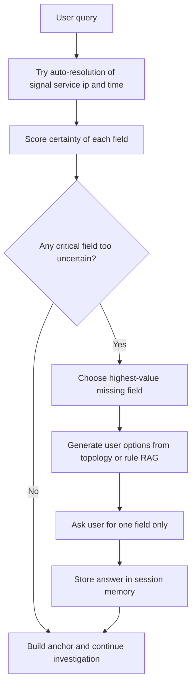

# Signal-First RCA Agent Plan

This file is the living design plan for the logs-only, signal-first RCA Agent.

We will keep updating this document step by step as the architecture changes.

## Recommended Reading Sequence

To make this document easier to follow, read it in this order:

1. `Current Direction`
   This sets the core design goal and the main operating principle.
2. `Whole Flow`
   This shows the end-to-end master graph for the full investigation path.
3. `Step Roles`
   This explains what each stage in the flow is responsible for.
4. `Current Design Principles`
   This captures the core rules that should stay true across all implementations.
5. `How JSON Catalogs and Vector DBs Work Together`
   This explains how signal knowledge is stored and used.
6. `Hierarchical Rule-RAG Routing Strategy`
   This explains how the correct signal knowledge scope is selected.
7. `Vector RAG Usage Policy`
   This explains where semantic retrieval helps and where it should be bounded.
8. `Two-Layer RAG Runtime Model`
   This explains how runtime signal retrieval happens in sequence.
9. `Exact Signal RAG Schema`
   This defines the exact record shape used for signal knowledge.
10. `Recommended Topology Schema`
    This defines the target topology contract for Agent AI.
11. `Recommended Log Query Contracts`
    This defines the exact tool input and output contracts for log retrieval.
12. `Topology Walk Strategy`
    This explains how topology traversal should stay efficient and accurate.
13. `Vague Query Drill-Down Strategy`
    This explains how the agent should behave when the user gives an underspecified question.
14. `Anchor Resolution Cycle`
    This explains how every fetch resolves `{ip, service, signal_set, time_window}`.
15. `Copilot Mode / Human Intervention Strategy`
    This explains when and how the user is brought into the loop.
16. `Recommended LangGraph Runtime Design`
    This explains the runtime state model, node responsibilities, memory, and checkpoints.
17. `Recommended RCA Output Contract`
    This defines what the agent should return for both analyst readability and machine consumption.
18. `Next Planned Design Areas`
    This lists the remaining design items.
19. `Detailed End-to-End Example`
    This shows one full investigation path from user query to final RCA.

## Current Direction

The current design principle is:

`user query -> time-first scope -> rule RAG over signal definitions -> signal-first search -> topology-guided expansion -> hypothesis testing -> RCA report`

The agent should not begin with random raw-log fields.
It should begin with:

- a bounded time window
- a known signal vocabulary
- a controlled evidence expansion strategy

## Current Implementation Snapshot

As of the current implementation, the system is no longer only a target design.
The following pieces are already implemented in the Python runtime:

1. `hybrid planner mode`
   The LangGraph runtime now supports a hybrid planner where:
   - the LLM chooses the next tool from the currently valid next-step options
   - code validates that choice
   - code still builds the actual tool arguments
   - deterministic routing remains the hard fallback if the planner output is invalid
   - if only one valid next tool exists, the runtime skips the planner call and takes the forced single-option path

2. `bounded LLM usage`
   The LLM is currently used in bounded places only:
   - scope resolution disambiguation
   - hybrid next-tool planning
   - topology candidate critique for ambiguous hop-selection rounds
   - weak-RCA critique for low-confidence outcomes
   - final analyst summary generation

3. `two-layer runtime retrieval`
   Signal retrieval now follows the intended two-layer model:
   - Layer 1 deterministic scope routing
   - Layer 2 semantic vector retrieval with lexical fallback

4. `canonical topology runtime`
   The active topology model now uses:
   - canonical root-level `nodes`
   - canonical root-level `edges`
   - version metadata
   - incident-time-aware topology selection
   - `depends_on` as the main RCA dependency relation

5. `streamlit observability`
   The Streamlit UI now exposes:
   - per-step tool inputs and outputs
   - Elasticsearch DSL request bodies
   - scope-resolution request and response
   - planner request and response
   - topology-walk graph and node drill-down
   - topology candidate comparison tables for each walk round
   - topology round critic decisions and applied service policies
   - retained alternate topology paths
   - confidence breakdown in the final report

6. `adaptive topology walk scoring`
   Topology expansion now uses richer per-neighbor comparison data:
   - explicit-signal evidence weight
   - generic-log evidence weight
   - chronology score
   - timing bonus
   - domain alignment
   - service alignment
   - dependency bias from service-specific RCA policy
   - hop-priority bias
   - optional topology-candidate critic override on ambiguous rounds

7. `confidence decomposition`
   Final confidence is now explained through stable components:
   - evidence base
   - explicit signal weight
   - generic log weight
   - chronology score
   - topology score
   - raw-context bonus
   - baseline anomaly weight
   - critic adjustment
   - contradiction penalty

8. `stronger anomaly and branch analysis`
   The runtime now adds:
   - healthy-window comparison using event-rate, signal-rate, severity, message novelty, and signal drift
   - service-specific RCA policies for scoring and dependency preference
   - retained alternate supported paths instead of only the winning branch

9. `service-specific contradiction rules`
   The report stage now adds a bounded contradiction layer that:
   - evaluates service-aware negative-evidence rules for `nginx`, `instancegunicorn`, `mongodb`, `postgresql`, `rabbitmq`, `redis`, and `kafka`
   - records structured `service_specific_contradictions` instead of only flat contradiction strings
   - applies a bounded `service_contradiction_penalty` into the final confidence breakdown
   - can downgrade a `confirmed_rca` result when service expectations are violated by the fetched evidence

Implementation note:

- this is now best described as a `hybrid workflow-driven agentic RCA system`
- planning is no longer purely deterministic
- execution is still intentionally deterministic and validated

## Whole Flow



Current implementation note:

- the Python runtime now uses a `hybrid planner`
- the planner sees the current state and the currently valid next-step tool options
- the LLM can choose the next tool
- the runtime validates that choice and falls back to deterministic routing if needed
- tool execution itself remains code-driven and schema-validated

## Step Roles

### 1. User asks RCA question

Role:
Receive a natural-language investigation request such as:

- `why was the network slow at 10:35?`
- `why did the application go down at this time?`
- `what caused this incident for this customer?`

Purpose:
Start from analyst intent, not from a preselected rule or hardcoded signal.

---

### 2. Parse query

Role:
Break the user request into machine-usable parts.

Expected extraction:

- incident wording
- time mention
- service hint
- host or device hint
- domain hint such as network, application, database, gateway

Purpose:
Convert a human question into structured search inputs.

---

### 3. Extract incident scope

Role:
Define the investigation boundary before any search begins.

Expected scope fields:

- organization or tenant
- service or device if known
- host or IP if known
- incident domain
- exact or approximate time

Purpose:
Prevent broad and noisy searches.

---

### 4. Build first-circle time window

Role:
Create the first bounded search window around the incident time.

Initial current idea:

- if the user gives a specific time, search `T-10m` to `T+10m`
- if the user gives a vague time, derive a best-effort default window

Purpose:
Make time the first hard boundary of the investigation.

Notes:
This first circle is intentionally narrow so the agent starts with the most relevant evidence.

---

### 5. Retrieve signal knowledge from rule RAG

Role:
Search the signalization rule base to learn which signals are relevant to the user’s question.

Knowledge source:

- `log_signalizing/rules/services`
- `log_signalizing/rules/network`
- vendor-specific network rules and service-specific signal rules

Purpose:
Teach the agent the allowed signal vocabulary instead of letting it invent search terms.

Expected output:

- signal names
- service family
- rule context
- keywords or descriptions that connect user intent to signals

---

### 6. Map user intent to candidate signals

Role:
Turn the parsed user question plus RAG results into a shortlist of signal names.

Example:

- user says `network slow`
- candidate signals may include:
  - interface flap
  - DNS timeout
  - upstream timeout
  - latency spike
  - packet loss related signal

Purpose:
Keep first-circle retrieval focused on normalized signal values.

Important rule:
The agent searches by known signals first, not random raw-log text first.

---

### 7. Query signalized events in first circle

Role:
Search only signalized records in the bounded time window using the candidate signals.

Typical filters:

- time range
- organization
- optional host, device, service
- `signal in candidate_signals`

Purpose:
Collect the cleanest first-pass evidence with the least noise.

Expected output:

- matching signalized events
- counts by signal
- first seen and last seen timestamps
- affected hosts and services
- severity distribution

---

### 8. Rank dominant signals and entities

Role:
Identify which signals and entities dominate the incident window.

Ranking factors:

- signal frequency
- severity
- recency near incident time
- temporal clustering
- number of affected entities

Purpose:
Turn a flat event list into an incident-shaped evidence summary.

---

### 9. Map dominant evidence to topology nodes

Role:
Take the strongest first-circle evidence and anchor it to known topology nodes.

Mapping targets:

- service node
- device node
- service on device
- upstream dependency
- downstream dependency

Purpose:
Convert event evidence into graph-aware investigation starting points.

Why this matters:
The agent should not expand blindly. It should expand from known devices, services, and dependency paths.

---

### 10. Enough evidence?

Role:
Decide whether the first circle already gives enough evidence to form strong candidate causes.

Strong first-circle evidence usually means:

- clear dominant signal family
- clear timeline concentration
- limited ambiguity between competing causes

Purpose:
Avoid unnecessary expansion when the signal-first view is already strong.

---

### 11. Expand through topology step by step

Role:
Widen the search carefully when the first circle is weak or mixed, but do it through topology-guided hops instead of broad search.

Expansion dimensions:

- slightly wider time window
- same host
- same device IP
- same service
- services on the same device
- direct upstream dependencies
- direct downstream dependencies
- neighboring or related signals from the same rule family

Purpose:
Gather supporting or disambiguating evidence without exploding the search scope.

Important rule:
Expansion should follow graph relationships, not random field matching.

---

### 12. Query nearby time, same device, same service, and topology neighbors

Role:
Run controlled follow-up queries around the matched first-circle evidence.

Examples:

- earlier warnings before the failure
- recovery signals after the failure
- repeated signal pattern on the same device
- related downstream timeout signals on connected services
- upstream device or service warnings that happened shortly before the impact
- other services on the same device showing correlated failure behavior

Purpose:
Build causality and chronology, not just coincidence.

---

### 13. Optional raw-log fallback around matched signals

Role:
Use raw logs only when signalized evidence remains too weak or incomplete.

Important principle:

- raw logs are fallback
- signalized events remain the primary evidence surface

Purpose:
Handle cases where:

- rules are incomplete
- a new pattern is not yet signalized
- the signal exists but needs surrounding message context

---

### 14. Generate candidate hypotheses

Role:
Create a small set of possible explanations from the evidence.

Examples:

- network instability caused application slowdown
- gateway failure caused the visible outage
- backend dependency issue propagated into the application

Purpose:
Move from retrieval to structured investigation.

Important rule:
Generate only a few hypotheses, and only from observed evidence.

---

### 15. Check contradictions and chronology

Role:
Test whether the top hypotheses fit the actual event order and evidence consistency.

Examples of contradiction checks:

- app failure started before the claimed network issue
- two top hypotheses are too close in support
- affected entities do not match the claimed root cause
- the claimed root cause is not upstream or otherwise connected in topology
- the blast radius does not fit the proposed dependency path

Purpose:
Reduce hallucination and overconfident explanations.

---

### 16. Calibrate confidence

Role:
Assign a confidence level to the best-supported explanation.

Confidence inputs may include:

- dominance of a signal family
- timeline clarity
- contradiction penalty
- breadth of blast radius
- amount of direct supporting evidence
- topology consistency between cause and impact nodes

Purpose:
Tell the user whether this is a confirmed RCA, a probable cause, or insufficient evidence.

---

### 17. Compose structured RCA report

Role:
Produce the final machine-readable and analyst-readable output.

Expected contents:

- likely root cause
- summary
- confidence
- classification
- timeline
- supporting evidence
- contradictions
- unknowns
- next checks

Purpose:
Return a result that is useful for both humans and automation.

---

### 18. Return answer with evidence and unknowns

Role:
Deliver the RCA response with clear support and clear limits.

Required behavior:

- do not hide uncertainty
- do not invent missing facts
- include evidence references
- include unknowns when proof is incomplete

Purpose:
Make the agent trustworthy for industrial RCA workflows.

## Current Design Principles

1. Search `signal` first, not arbitrary raw-log fields first.
2. Use signalization rules as the main knowledge source for vocabulary.
3. Use time as the first hard investigation boundary.
4. Use topology as the main guidance layer for step-by-step expansion.
5. Expand search in circles, not in an uncontrolled way.
6. Use raw logs as fallback evidence, not the default entry point.
7. Prefer abstention over hallucination.
8. Every final conclusion should be traceable to evidence.

## How JSON Catalogs and Vector DBs Work Together

The retrieval chain is:

```text
YAML rules -> JSON catalogs -> vector DBs -> candidate signals -> log validation -> RCA
```

Each layer has one job:

- `JSON catalogs`
  provide exact structured fields such as `service`, `vendor`, `domain`, `signal`, `related_signals`, and `query_hints`
- `vector DBs`
  rank semantically relevant signals for the user's wording inside an allowed scope
- `logs and topology`
  confirm what actually happened and whether it fits the incident path

Working rule:

- JSON controls scope
- vector DB ranks candidates
- logs and topology confirm truth

## Hierarchical Rule-RAG Routing Strategy

Always search the smallest valid signal scope first.

Routing order:

1. if `service` is known, use only that service catalog and vector DB
2. else if `vendor` is known, use only that vendor catalog and vector DB
3. else infer `service` or `vendor` from topology, logs metadata, memory, or copilot input
4. else use the global signal catalog as a bounded fallback

Storage shape:

- `rag/services/<service>.json`
- `rag/network/<vendor>.json`
- `rag_db/services/<service>`
- `rag_db/network/<vendor>`

Important rules:

- prefer service scope over vendor scope when both are known
- prefer vendor scope over global scope when service is unknown
- use global fallback only when narrowing fails or the user selects `all`
- when `all` is selected, aggregate and rank first before any deep fetch

## Vector RAG Usage Policy

Vector retrieval is a semantic assist layer, not a proof layer.

Use vector search for:

- vague user wording
- synonym matching
- symptom-to-signal-family mapping
- ranking related signals inside a bounded scope

Do not use vector search alone for:

- final root-cause selection
- topology path validation
- incident confirmation
- confidence scoring

Safe pattern:

```text
route -> vector-rank -> metadata filter -> query logs -> validate with evidence
```

Important rules:

- structured routing must happen before vector ranking whenever possible
- keep only a small top-ranked candidate signal set
- final RCA must come from logs, chronology, topology, and contradiction checks

## Two-Layer RAG Runtime Model

The runtime model is:

```text
Layer 1 = deterministic routing
Layer 2 = semantic retrieval
```

### Layer 1. Deterministic routing

Layer 1 decides:

- which catalog or vector DB is allowed
- which metadata filters apply
- whether the scope is `service`, `vendor`, or `global`

Typical inputs:

- user query
- selected service
- selected vendor
- selected IP
- topology metadata
- logs metadata
- session memory
- copilot selections

### Layer 2. Semantic retrieval

Layer 2 decides:

- which signals inside the allowed scope are most relevant
- which related signals are worth checking next

Typical outputs:

- top-ranked candidate signals
- related signals
- rule context for query planning

### Runtime Sequence



### Runtime Rules

1. Always run Layer 1 before Layer 2.
2. Always read the JSON records for the signals returned by vector search.
3. Use the JSON records to get exact `signal`, `related_signals`, `summary`, and `query_hints`.
4. Build the actual fetch tuple as `{ip, service, signal_set, time_window}`.
5. Treat retrieved signals as candidates until logs confirm them.
6. Never let vector similarity directly determine final RCA confidence.
7. Keep YAML as the source of truth and regenerate JSON plus vector DBs when rules change.

## Exact Signal RAG Schema

This section defines the exact structure of signal knowledge used by the agent.

The goal is to keep signal retrieval consistent across:

- JSON catalogs
- vector DBs
- routing
- runtime retrieval

### 1. Retrieval Unit

One retrievable unit should be:

- `one signal record`

Not:

- one whole YAML file
- one large service document
- one mixed signal family blob

This keeps retrieval precise and makes scoring easier.

### 2. Canonical JSON Record

Each signal record should follow this structure:

```json
{
  "id": "mongodb::mongodb_slow_query",
  "service": "mongodb",
  "vendor": null,
  "domain": "database",
  "rule_file": "mongodb.yml",
  "signal": "mongodb_slow_query",
  "title": "MongoDB slow query",
  "summary": "Indicates query latency degradation or inefficient query execution.",
  "symptom_keywords": [
    "mongo slow",
    "mongodb latency",
    "slow query",
    "database response delay"
  ],
  "related_signals": [
    "mongodb_lock_contention",
    "mongodb_connection_saturation",
    "mongodb_replication_lag"
  ],
  "query_hints": {
    "likely_entities": ["service", "host", "ip", "replica_set"],
    "default_time_bias": "same_window"
  }
}
```

### 3. Embedding Text Schema

The vector DB should embed a compact text built from the JSON record.

Recommended embedding payload:

```text
signal: mongodb_slow_query
title: MongoDB slow query
summary: Indicates query latency degradation or inefficient query execution.
service: mongodb
domain: database
symptom keywords: mongo slow, mongodb latency, slow query, database response delay
related signals: mongodb_lock_contention, mongodb_connection_saturation, mongodb_replication_lag
```

Purpose:

- keep semantic retrieval focused on signal meaning
- avoid embedding unnecessary YAML noise

### 4. Metadata Filter Schema

Every record should support routing and filtering through metadata such as:

```json
{
  "service": "mongodb",
  "vendor": "",
  "domain": "database",
  "rule_file": "mongodb.yml",
  "signal": "mongodb_slow_query"
}
```

Minimum filterable fields:

- `service`
- `vendor`
- `domain`
- `rule_file`
- `signal`

### 5. Retrieval Output Schema

The first retrieval result should return scored candidate matches.

Example:

```json
[
  {
    "id": "mongodb::mongodb_slow_query",
    "score": 0.91,
    "signal": "mongodb_slow_query",
    "service": "mongodb",
    "domain": "database"
  }
]
```

This is the ranking output, not yet the final signal set.

### 6. Thresholded Signal Extraction Layer

After scored retrieval, the system should run one more small filtering layer.

Its job is:

- keep only signals above a confidence threshold
- convert scored matches into a clean signal list for log queries

Example:

```json
{
  "threshold": 0.8,
  "signals": [
    "mongodb_slow_query",
    "mongodb_lock_contention"
  ]
}
```

Recommended rule:

- retrieve top `k` candidates
- keep only signals whose `score >= threshold`
- if no signal passes the threshold, either:
  - lower the threshold carefully in discovery mode, or
  - fall back to copilot clarification, or
  - use broader aggregate search

Purpose:

- reduce noisy signal expansion
- keep log queries bounded
- separate semantic ranking from actual query planning

### 7. Runtime Usage Order

The signal knowledge should be used in this order:

1. route to the valid catalog and vector DB
2. retrieve scored candidate matches
3. apply threshold filtering to produce `signal_set`
4. read the full JSON records for the surviving signals
5. use `related_signals` and `query_hints` only for bounded expansion
6. query logs with `{ip, service, signal_set, time_window}`

### 8. Schema Rules

1. One signal record equals one retrieval unit.
2. JSON is the canonical structured source for runtime meaning.
3. Vector DB is built from the JSON record, not directly from raw YAML.
4. Retrieval should return scored candidates first, then a thresholded signal list.
5. The thresholded signal list is what should be used for actual log querying.

## Recommended Topology Schema

The recommended topology contract for agentic RCA is a canonical `nodes + edges` graph.

The goal is to help the agent answer four questions reliably:

1. which topology node does this log belong to
2. which node should be investigated next
3. which service or vendor scope should be used for signal retrieval
4. whether a candidate cause is upstream, downstream, or unrelated

Important principle:

- keep the current organization and topology grouping
- improve the internal topology shape for better identity mapping and traversal

### Recommended Top-Level Shape

This `schema_version: 2` contract is the target format for the Agent AI flow.
The current Python implementation already materializes versioned root-level documents in this shape.

Current assumption:

- the Agent AI path can adopt `schema_version: 2`
- the existing Go runtime can continue using the current topology reader until it is updated later
- backward compatibility in Go is a later implementation task, not a blocker for the Agent AI design

Recommended adoption rule:

- treat `schema_version: 2` as the canonical topology format for the new agentic workflow
- migrate the Go code separately when you are ready

```json
{
  "_id": "135098068173316952064::infraon_onprem_prod::current__topology_json__135098068173316952064__infraon_onprem_prod",
  "organization_id": "135098068173316952064",
  "topology_id": "infraon_onprem_prod",
  "topology_name": "Infraon Onprem Production",
  "environment": "prod",
  "is_enabled": true,
  "source_kind": "current",
  "source_file_name": "topology.json",
  "schema_version": 2,
  "generated_at": "2026-05-21T05:43:53.587Z",
  "source_collection": "topology_data",
  "version": {
    "version_id": "current__topology_json__135098068173316952064__infraon_onprem_prod",
    "valid_from": "2026-05-21T05:43:53.587Z",
    "valid_to": null,
    "is_current": true
  },
  "sources": [],
  "incident_time_lookup": {
    "valid_from": "2026-05-21T05:43:53.587Z",
    "valid_to": null,
    "is_current": true,
    "selection_mode": "version_window"
  },
  "nodes": [],
  "edges": []
}
```

### Node Schema

Recommended node shape:

```json
{
  "node_id": "10.0.4.72::mongodb",
  "node_type": "service",
  "service_name": "mongodb",
  "service_aliases": ["mongo", "mongodb", "mongodb-primary"],
  "device_ip": "10.0.4.72",
  "ip_aliases": ["10.0.4.72"],
  "host_name": "localhost.localdomain",
  "host_aliases": ["db-01"],
  "vendor": null,
  "platform": "mongodb",
  "tier": "data",
  "role": "primary_operational_database",
  "cluster_id": "mongo-prod-a",
  "replica_set": "rs0",
  "is_entrypoint": false,
  "criticality": "critical",
  "match_fields": [
    "service.name",
    "event.module",
    "mongodb.log.component",
    "host.name",
    "host.ip"
  ],
  "tags": ["database", "stateful", "primary"]
}
```

### Edge Schema

Recommended edge shape:

```json
{
  "edge_id": "10.0.4.72::instancegunicorn->10.0.4.72::mongodb::depends_on",
  "from_node_id": "10.0.4.72::instancegunicorn",
  "to_node_id": "10.0.4.72::mongodb",
  "relation_type": "depends_on",
  "relation_label": "crud_report_instancegunicorn_db_path",
  "weight": 1.0,
  "criticality": "critical",
  "source_refs": [
    "dependencies[10.0.4.72::instancegunicorn->10.0.4.72::mongodb]"
  ]
}
```

Important implementation rule:

- `depends_on` is the canonical RCA relation
- upstream and downstream should be derived in code from canonical edges
- do not store duplicated `upstream` and `downstream` lists as the source of truth

### Field Meanings And Use Cases

#### Top-level fields

- `schema_version`
  Use:
  version the topology contract safely over time.

- `organizations`
  Use:
  isolate topology and RCA routing by tenant or organization.

- `topology_id`
  Use:
  distinguish multiple topologies or environments inside one organization.

- `topology_name`
  Use:
  human-readable label for operators and reports.

- `environment`
  Use:
  distinguish `prod`, `staging`, `lab`, or `dev`.

#### Node identity fields

- `node_id`
  Use:
  canonical identity for the agent.
  Best format is `ip::service`.
  This should be the main node key used during topology walk.

- `service_name`
  Use:
  primary logical service name for routing and RCA reasoning.

- `service_aliases`
  Use:
  map vague user wording and log variants back to the same node.

- `device_ip`
  Use:
  primary IP for log-to-node mapping.

- `ip_aliases`
  Use:
  support multiple interfaces, VIPs, NAT, or alternate IP identities.

- `host_name`
  Use:
  primary host identity from infrastructure or logs.

- `host_aliases`
  Use:
  support short names, FQDNs, inventory names, or old host references.

#### Node classification fields

- `node_type`
  Use:
  classify a node as `service`, `device`, `underlay`, `database`, `queue`, or similar.
  Helps traversal and hypothesis ranking.

- `vendor`
  Use:
  narrow vendor-specific rule RAG, mainly for network and appliance cases.

- `platform`
  Use:
  identify the runtime or product type such as `mongodb`, `nginx`, `redis`, or `cisco_ios`.

- `tier`
  Use:
  separate `edge`, `app`, `data`, and `infra` layers for blast-radius reasoning.

- `role`
  Use:
  provide a clear human and agent hint about the node’s job.

- `cluster_id`
  Use:
  group horizontally related nodes for cluster-level RCA.

- `replica_set`
  Use:
  support stateful systems like MongoDB, Kafka, Postgres, or Redis replication.

- `is_entrypoint`
  Use:
  mark nodes exposed to users or external callers such as gateways or ingress layers.

- `criticality`
  Use:
  prioritize which nodes matter more during RCA.

- `tags`
  Use:
  lightweight category labels for filtering and retrieval.

#### Mapping fields

- `match_fields`
  Use:
  tell the agent which log fields are best for mapping evidence to this node.
  This improves accuracy when logs are inconsistent across services.

#### Edge fields

- `edge_id`
  Use:
  stable reference for debugging, analytics, and RCA explanations.

- `from` and `to`
  Use:
  represent directional dependency between canonical nodes.

- `relation_type`
  Use:
  machine-readable normalized dependency type.
  Examples:
  `calls`, `reads_from`, `writes_to`, `reads_writes_db`, `publishes_to`, `consumes_from`, `depends_on_network`, `depends_on_host`.

- `relation_label`
  Use:
  preserve the original human or domain-specific relationship label.

- `direction`
  Use:
  make traversal direction explicit, usually `upstream`.

- `weight`
  Use:
  prioritize stronger dependency paths first during topology expansion.

- `criticality`
  Use:
  indicate how important that edge is in impact propagation.

### Mapping Rules

#### User query to topology

Use:

- `service_aliases`
- `vendor`
- `platform`
- `tags`

Purpose:
map vague user intent to likely nodes or node groups.

#### Logs to topology

Use:

- `host.ip` -> `device_ip` or `ip_aliases`
- `host.name` -> `host_name` or `host_aliases`
- `service.name` -> `service_name` or `service_aliases`
- extra fields from `match_fields`

Purpose:
map observed evidence to one canonical node.

#### Signals to topology

Use:

- RAG-selected service or vendor scope
- node `service_name`
- node `vendor`
- node `platform`

Purpose:
turn retrieved candidate signals into node-specific log queries.

### Recommended Practical Rules

1. Every dependency endpoint should exist as a declared node.
2. `node_id` should be the canonical identity used during topology walk.
3. `service_aliases`, `host_aliases`, and `ip_aliases` should be used to improve evidence matching.
4. `relation_type` should be normalized even if `relation_label` remains free-form.
5. `weight` should be used to rank which neighbor is checked first.
6. `match_fields` should guide log-to-node mapping when logs are inconsistent.
7. The agent should prefer `nodes + edges` as the reasoning model even if older compatibility arrays are still kept.

## Recommended Log Query Contracts

The recommended query stack is:

```text
aggregate_discovery
-> signal_candidate_retrieval
-> first_circle_search
-> topology_hop_search
-> raw_log_fallback
```

Design rules:

- one contract should do one job only
- all contracts should share a small common data model
- signal retrieval and evidence validation should stay separate

This gives the best balance of:

- accuracy
- low noise
- low latency
- low rework

### Shared Contract Types

#### TimeWindow

```json
{
  "start": "2026-05-20T10:25:00Z",
  "end": "2026-05-20T10:45:00Z",
  "scope_label": "last_20_minutes"
}
```

#### NodeRef

```json
{
  "node_id": "10.0.4.72::mongodb",
  "service": "mongodb",
  "ip": "10.0.4.72",
  "host": "db-01"
}
```

#### SignalCandidate

```json
{
  "id": "mongodb::mongodb_slow_query",
  "score": 0.91,
  "signal": "mongodb_slow_query",
  "service": "mongodb",
  "vendor": null,
  "domain": "database"
}
```

#### EvidenceEvent

```json
{
  "event_id": "evt-123",
  "timestamp": "2026-05-20T10:35:09Z",
  "signal": "mongodb_slow_query",
  "service": "mongodb",
  "ip": "10.0.4.72",
  "host": "db-01",
  "severity": "warning",
  "organization_id": "135098068173316952064"
}
```

### 1. Aggregate Discovery

Purpose:

- handle vague queries
- discover likely incident windows
- rank hotspot services, IPs, and signals before deep RCA

Input contract:

```json
{
  "organization_id": "135098068173316952064",
  "time_scope": {
    "label": "last_6_hours",
    "start": "2026-05-20T04:00:00Z",
    "end": "2026-05-20T10:00:00Z"
  },
  "service": "mongodb",
  "vendor": null,
  "domain": "database",
  "candidate_signals": [
    "mongodb_slow_query",
    "mongodb_replication_lag",
    "mongodb_lock_contention"
  ],
  "bucket_size": "5m",
  "top_k": 10
}
```

Output contract:

```json
{
  "hotspots": [
    {
      "time_window": {
        "start": "2026-05-20T09:30:00Z",
        "end": "2026-05-20T09:40:00Z",
        "scope_label": "hotspot_bucket"
      },
      "top_signals": [
        "mongodb_slow_query",
        "mongodb_lock_contention"
      ],
      "top_services": [
        "mongodb"
      ],
      "top_ips": [
        "10.0.4.72"
      ],
      "score": 0.89
    }
  ],
  "signal_counts": {
    "mongodb_slow_query": 23,
    "mongodb_lock_contention": 9
  },
  "service_counts": {
    "mongodb": 31
  },
  "ip_counts": {
    "10.0.4.72": 31
  }
}
```

### 2. Signal Candidate Retrieval

Purpose:

- convert user intent into a bounded signal set
- route to the correct JSON catalog and vector DB
- threshold scored results into `signals[]`

Input contract:

```json
{
  "user_query": "why is mongo db slow",
  "service": "mongodb",
  "vendor": null,
  "domain": "database",
  "topology_node": {
    "node_id": "10.0.4.72::mongodb",
    "service": "mongodb",
    "ip": "10.0.4.72",
    "host": "db-01"
  },
  "top_k": 8,
  "score_threshold": 0.8
}
```

Output contract:

```json
{
  "scope": {
    "type": "service",
    "service": "mongodb",
    "vendor": null,
    "catalog_path": "rag/services/mongodb.json",
    "vector_db_path": "rag_db/services/mongodb"
  },
  "scored_candidates": [
    {
      "id": "mongodb::mongodb_slow_query",
      "score": 0.91,
      "signal": "mongodb_slow_query",
      "service": "mongodb",
      "vendor": null,
      "domain": "database"
    },
    {
      "id": "mongodb::mongodb_lock_contention",
      "score": 0.84,
      "signal": "mongodb_lock_contention",
      "service": "mongodb",
      "vendor": null,
      "domain": "database"
    }
  ],
  "signal_set": [
    "mongodb_slow_query",
    "mongodb_lock_contention"
  ],
  "related_signals": [
    "mongodb_replication_lag"
  ]
}
```

### 3. First-Circle Search

Purpose:

- fetch the first bounded slice of signalized evidence
- keep noise low by using tight filters

Input contract:

```json
{
  "organization_id": "135098068173316952064",
  "time_window": {
    "start": "2026-05-20T09:25:00Z",
    "end": "2026-05-20T09:45:00Z",
    "scope_label": "first_circle"
  },
  "service": "mongodb",
  "ip": "10.0.4.72",
  "signals": [
    "mongodb_slow_query",
    "mongodb_lock_contention"
  ],
  "limit": 200
}
```

Output contract:

```json
{
  "events": [
    {
      "event_id": "evt-123",
      "timestamp": "2026-05-20T09:33:10Z",
      "signal": "mongodb_slow_query",
      "service": "mongodb",
      "ip": "10.0.4.72",
      "host": "db-01",
      "severity": "warning",
      "organization_id": "135098068173316952064"
    }
  ],
  "signal_counts": {
    "mongodb_slow_query": 23,
    "mongodb_lock_contention": 9
  },
  "first_seen": "2026-05-20T09:30:12Z",
  "last_seen": "2026-05-20T09:39:41Z",
  "entities": [
    {
      "node_id": "10.0.4.72::mongodb",
      "service": "mongodb",
      "ip": "10.0.4.72",
      "host": "db-01"
    }
  ]
}
```

### 4. Topology-Hop Search

Purpose:

- fetch evidence for one topology-guided step
- inspect same node, same device, upstream, or downstream neighbors

Input contract:

```json
{
  "organization_id": "135098068173316952064",
  "source_node": {
    "node_id": "10.0.4.72::instancegunicorn",
    "service": "instancegunicorn",
    "ip": "10.0.4.72",
    "host": "app-01"
  },
  "target_node": {
    "node_id": "10.0.4.72::mongodb",
    "service": "mongodb",
    "ip": "10.0.4.72",
    "host": "db-01"
  },
  "hop_type": "upstream",
  "relation_type": "reads_writes_db",
  "time_window": {
    "start": "2026-05-20T09:20:00Z",
    "end": "2026-05-20T09:36:00Z",
    "scope_label": "upstream_hop"
  },
  "signals": [
    "mongodb_slow_query",
    "mongodb_lock_contention",
    "mongodb_replication_lag"
  ],
  "limit": 100
}
```

Output contract:

```json
{
  "events": [
    {
      "event_id": "evt-456",
      "timestamp": "2026-05-20T09:28:11Z",
      "signal": "mongodb_lock_contention",
      "service": "mongodb",
      "ip": "10.0.4.72",
      "host": "db-01",
      "severity": "warning",
      "organization_id": "135098068173316952064"
    }
  ],
  "signal_counts": {
    "mongodb_lock_contention": 9
  },
  "node_summary": {
    "node_id": "10.0.4.72::mongodb",
    "service": "mongodb",
    "ip": "10.0.4.72",
    "host": "db-01",
    "match_score": 0.87
  },
  "contradiction_hints": []
}
```

### 5. Raw-Log Fallback

Purpose:

- fetch raw logs only when signalized evidence is insufficient
- inspect message-level context around a strong anchor

Input contract:

```json
{
  "organization_id": "135098068173316952064",
  "anchor_event_ids": [
    "evt-456"
  ],
  "node": {
    "node_id": "10.0.4.72::mongodb",
    "service": "mongodb",
    "ip": "10.0.4.72",
    "host": "db-01"
  },
  "time_window": {
    "start": "2026-05-20T09:27:00Z",
    "end": "2026-05-20T09:31:00Z",
    "scope_label": "raw_context"
  },
  "limit": 80
}
```

Output contract:

```json
{
  "raw_logs": [
    {
      "log_id": "raw-789",
      "timestamp": "2026-05-20T09:28:08Z",
      "service": "mongodb",
      "ip": "10.0.4.72",
      "host": "db-01",
      "severity": "warning",
      "message": "Slow query exceeded threshold on collection incidents",
      "source_index": "raw-logs-mongodb"
    }
  ],
  "anchor_event_ids": [
    "evt-456"
  ]
}
```

### Data Sources

The contracts draw data from these places:

- signal knowledge:
  - `rag/services/*.json`
  - `rag/network/*.json`
  - `rag_db/services/*`
  - `rag_db/network/*`
- topology:
  - current topology file
  - later `schema_version: 2` topology contract for Agent AI
- signalized evidence:
  - signalized logs index or event store
- raw context:
  - raw logs index or source log store
- routing hints:
  - user query
  - copilot choices
  - session memory
  - topology aliases
  - logs metadata

### Contract Rules

1. `aggregate_discovery` is for vague-query hotspot finding, not final RCA.
2. `signal_candidate_retrieval` is for bounded signal selection, not evidence confirmation.
3. `first_circle_search` is the default first evidence fetch.
4. `topology_hop_search` is the only contract used for step-by-step topology expansion.
5. `raw_log_fallback` should be used only when signalized evidence is still weak.
6. All contracts should return consistent node, time, and signal shapes to reduce rework in the graph.

## Topology Walk Strategy

This section defines how the agent should move through topology during investigation.

The main idea is:

`start narrow -> walk locally first -> move upstream before broad expansion -> stop early when confidence is strong -> fall back in layers when evidence is weak`

### Hop Order

The topology walk should be bounded and priority-driven.
It should not traverse the full graph.

Default hop order:

1. `same node`
   Check the exact impacted service, device, or service-on-device node first.
2. `same device`
   Check other services running on the same host or device.
3. `direct upstream neighbors`
   Check immediate dependencies that can plausibly cause the observed impact.
4. `direct downstream neighbors`
   Check immediate impact propagation to confirm blast radius and direction.
5. `optional second-hop upstream`
   Only use when the first hop does not explain the incident clearly.

Recommended default traversal limits:

- `max_hops = 1` for normal investigations
- `max_hops = 2` only when evidence remains weak
- `top_neighbors_per_node = 2` or `3`

Why this order:

- most incidents are explained locally or by one upstream dependency
- same-device evidence is cheap and often highly relevant
- upstream evidence is usually more useful for root cause than downstream evidence

### Ranking Rules

Before querying neighbors, the agent should rank them.
Not every connected node should be queried equally.

Suggested ranking factors:

1. topology direction
   Upstream nodes rank higher than downstream nodes for root-cause search.
2. time proximity
   Events that occur just before the impacted signal rank higher.
3. signal relevance
   Nodes with signal families that match the user intent or rule-RAG results rank higher.
4. severity
   Critical and error-level signals rank above informational noise.
5. same-device bonus
   Services on the same host or device get a priority boost.
6. incident spread value
   Nodes that explain several impacted downstream entities rank higher.
7. history bonus
   If historical incident memory exists later, nodes seen in similar past RCA cases can rank higher.

Practical ranking priority:

1. same node
2. same device
3. direct upstream with matching signals
4. direct upstream with any critical signals
5. direct downstream for propagation confirmation
6. second-hop upstream only when still unclear

### Early Stopping

The agent should stop expansion as soon as the evidence is strong enough.

Stop conditions may include:

- one node or incident path clearly dominates by signal count and severity
- event chronology strongly supports one upstream cause
- contradictions are low or absent
- confidence crosses the configured threshold

Recommended default policy:

- stop after first-circle or first-hop expansion if confidence is already high
- do not continue walking just because more topology exists
- prefer fast, supported answers over exhaustive but slow graph traversal

Example threshold idea:

- `confidence >= 0.80` and no major contradiction means stop

### Fallback Ladder

Fallback should happen in controlled layers.

Recommended fallback order:

1. `first-circle signal search`
   Query signalized events in the initial time window using candidate signals.
2. `topology-guided local expansion`
   Check same node, same device, and direct neighbors.
3. `second-circle signal expansion`
   Slightly widen time and allow one more topology hop if needed.
4. `raw-log context fallback`
   Fetch raw logs only around the strongest matched signals or nodes.
5. `insufficient evidence`
   If the evidence still does not separate causes clearly, return a limited-confidence result instead of guessing.

Important fallback rule:

- raw logs are a support layer, not the primary search surface

### Latency Controls

The system should be designed to minimize query count and avoid unnecessary graph traversal.

Recommended controls:

1. preload topology in memory
   Device, service, and dependency lookups should be local and fast.
2. query signalized data first
   Signalized events are cheaper and cleaner than raw logs.
3. batch neighbor queries
   Query top-ranked neighbors together instead of one-by-one where possible.
4. cap time expansion
   Use small windows such as `T-10m to T+10m`, then `T-20m to T+20m` if needed.
5. cap hop count
   Keep default traversal to one hop and only escalate to two hops when evidence is weak.
6. cap neighbor count
   Limit checked neighbors to the top-ranked few.
7. use early stopping
   End the investigation when confidence is strong enough.
8. defer raw-log queries
   Only use raw logs for the strongest unresolved candidates.

Expected result:

- fewer tool calls
- lower end-to-end latency
- less irrelevant evidence
- better RCA accuracy due to tighter search boundaries

## Vague Query Drill-Down Strategy

This section defines how the agent should behave when the user asks a vague RCA question without enough scope information.

Example vague questions:

- `why is mongo db slow down?`
- `why is the network slow?`
- `why did the application go down?`

These questions may be missing:

- exact time
- host
- device
- service instance
- cluster
- organization

The main idea is:

`when scope is missing, enter discovery mode first -> detect likely incident windows and hotspots -> then enter RCA mode for the strongest candidate`

Important principle:

- discovery mode is not the same as RCA mode
- the agent should first discover `when` and `where`
- only then should it explain `why`

### Formal Flow



### 1. Parse user intent

Role:
Understand the domain and symptom in the question.

Examples:

- `mongo db slow` suggests a database performance investigation
- `network slow` suggests a network performance investigation
- `application down` suggests a service availability investigation

Purpose:
Determine what kind of signals and entities should be searched first.

---

### 2. Detect missing scope fields

Role:
Identify which key investigation boundaries are missing.

Typical missing fields:

- time
- host
- device
- service instance
- cluster
- tenant or organization

Purpose:
Switch the agent into discovery mode instead of immediate RCA mode.

---

### 3. Use rule RAG to map query to signal families

Role:
Convert the vague symptom into a shortlist of known signal families from the signalization rules.

Example for MongoDB:

- slow query signals
- replication lag signals
- connection saturation signals
- storage or journaling warnings
- memory pressure signals
- election or failover signals

Purpose:
Constrain the search to normalized signal vocabulary before querying evidence.

---

### 4. Run coarse summary queries on recent time ranges

Role:
Search recent data using summary and aggregation queries instead of pulling full event documents.

Typical default windows:

- last `1h`
- last `6h`
- last `24h`

Purpose:
Find where the strongest evidence clusters exist without flooding the system or the LLM.

Important principle:

- aggregate first
- retrieve documents later

---

### 5. Aggregate by time bucket, signal, host, and service

Role:
Build a coarse incident map from signalized data.

Useful aggregations:

- counts by `signal`
- counts by `host`
- counts by `service`
- counts by `device`
- counts by time bucket such as `5m` or `10m`

Purpose:
Detect concentration, spikes, and abnormal clusters.

---

### 6. Detect anomalous windows and hotspots

Role:
Find candidate incident windows from the aggregates.

A hotspot can be:

- a time bucket with a strong signal spike
- a host with concentrated error signals
- a service showing a sudden slowdown-related pattern

Purpose:
Turn a vague question into one or more concrete investigation candidates.

---

### 7. Rank candidate windows

Role:
Score the discovered hotspots before deeper investigation.

Suggested ranking factors:

- match to the user symptom
- signal severity
- signal concentration
- number of affected entities
- recency
- temporal sharpness of the spike

Purpose:
Choose the most promising candidate instead of investigating everything.

---

### 8. Strong hotspot found?

Role:
Decide whether the discovery stage found a credible incident candidate.

If yes:

- continue into detailed RCA investigation

If no:

- return that no clear incident was found
- or request narrower scope from the user

Purpose:
Avoid speculative RCA when there is no strong evidence anchor.

---

### 9. Select top hotspot

Role:
Choose the single best candidate window and entity cluster for deeper analysis.

Typical output:

- chosen time window
- dominant signal family
- dominant host or service
- dominant device if available

Purpose:
Create a precise investigation scope for RCA mode.

---

### 10. Fetch detailed signalized evidence for hotspot

Role:
Retrieve detailed signalized events only for the chosen hotspot.

Typical filters:

- selected time window
- top-ranked signal family
- top host or service
- optional organization or cluster filter

Purpose:
Build a focused evidence pack for deeper reasoning.

---

### 11. Map hotspot evidence to topology nodes

Role:
Convert the strongest hotspot entities into topology starting nodes.

Mapping targets:

- service node
- device node
- service on device
- dependency neighbor candidates

Purpose:
Prepare for topology-guided RCA instead of blind expansion.

---

### 12. Run topology-guided RCA investigation

Role:
Use the normal bounded topology walk on the selected hotspot.

This means:

- same node first
- same device next
- upstream neighbors after that
- downstream confirmation only as needed

Purpose:
Move from hotspot detection into actual causal investigation.

---

### 13. Check contradictions and confidence

Role:
Evaluate whether the candidate RCA is actually supported by chronology, topology, and evidence concentration.

Purpose:
Prevent vague-query handling from becoming guess-heavy.

---

### 14. Return RCA report

Role:
Return either:

- a supported RCA result
- a probable cause with limits
- or a no-clear-incident result when discovery did not find enough evidence

Purpose:
Keep the system honest when the initial user query is underspecified.

### Recommended Operational Rules

1. For vague questions, always start in discovery mode.
2. Use aggregated signal queries before fetching event documents.
3. Rank incident hotspots before choosing one for deep investigation.
4. Investigate only the strongest hotspot first.
5. Use topology only after a hotspot is selected.
6. If no hotspot is strong enough, do not force an RCA.

## Anchor Resolution Cycle

This section defines the core unit of investigation for the RCA agent.

The main idea is:

`every fetch should revolve around one compact investigation tuple`

```text
{ ip, service, signal_set, time_window }
```

The agent should keep discovering and refining this tuple step by step.
This tuple is the anchor used for every focused fetch.

Important principle:

- the agent does not fetch broadly
- the agent first tries to determine a strong anchor
- every next query should use the best current anchor

### Why This Matters

For effective RCA, the system needs to narrow on four key dimensions:

1. `ip`
2. `service`
3. `signal_set`
4. `time_window`

Without these four fields, log fetching becomes too broad and noisy.

This anchor cycle gives the agent a repeatable way to determine them.

### Formal Cycle



### Anchor Tuple Definition

Each focused fetch should aim to determine:

- `ip`
  The most concrete network or host identity available for the current node.
- `service`
  The active service or service family relevant to the investigation.
- `signal_set`
  A bounded shortlist of candidate signals for that service and situation.
- `time_window`
  A bounded time range derived from incident evidence and traversal direction.

### Two Operating Modes

The anchor cycle works in two modes.

#### 1. Discovery Mode

Used when the initial user query is vague and the first anchor is not yet known.

Goal:

- find the first usable anchor

Typical order:

1. rough recent time range
2. rough signal family from rule RAG
3. dominant host, IP, service, or device from aggregates
4. topology mapping of the dominant entity

Example result:

```text
ip = 10.1.4.12
service = mongodb-primary
signal_set = [mongodb_slow_query, mongodb_replication_lag, mongodb_lock_contention]
time_window = 10:30 to 10:45
```

#### 2. Topology Walk Mode

Used after the first usable anchor is found.

Goal:

- refine the anchor at each hop
- use the refined anchor for the next bounded fetch

### Per-Hop Resolution Order

For each topology step, the agent should resolve the four fields in a strict order.

#### Step 1. Resolve IP

Priority:

1. topology node IP
2. IP from matched signalized event
3. host-to-IP mapping
4. device or service relation fallback

Rule:

- if IP is weak or missing, expansion should stay conservative

#### Step 2. Resolve service

Priority:

1. service from matched signal event
2. service from topology node definition
3. known services on the same device
4. service inferred from the rule family

Rule:

- the same IP may host more than one service
- service resolution should happen before signal expansion

#### Step 3. Resolve signal set

Do not query every signal.
Build a bounded signal set from:

1. currently matched signal
2. related signals from the same rule family
3. service-specific rules
4. expected upstream or downstream signals

Rule:

- prefer a small signal set over a broad one

#### Step 4. Resolve time window

The time window should be dynamic, not fixed.

It should be inherited from observed evidence and traversal direction.

Default guidance:

- `same node`: symmetric time window around the matched event
- `same device`: small symmetric window
- `upstream`: bias the window earlier
- `downstream`: bias the window later

Example:

- impacted event at `10:35:20`

Possible windows:

- same node: `10:25 to 10:45`
- upstream: `10:20 to 10:36`
- downstream: `10:35 to 10:50`

### Anchor-Driven Query Rule

Every focused query should look like:

```text
query logs where:
  ip = resolved_ip
  service = resolved_service
  signal in resolved_signal_set
  timestamp in resolved_time_window
```

This is the preferred investigation unit for both signalized event queries and later fallback log context queries.

### Choosing the Next Neighbor

The next topology node should not be chosen only because it is connected.

It should be selected because it is relevant to the current anchor.

Suggested neighbor ranking factors:

- same device bonus
- upstream bonus
- earlier-than-impact bonus
- matching signal-family bonus
- critical severity bonus
- blast-radius explanatory value

Recommended rule:

- only query the top `2` neighbors by default

### Time Window Layers

The system should use three layers of time logic.

#### 1. Discovery window

Used to find the first hotspot.

Examples:

- last `1h`
- last `6h`
- last `24h`

#### 2. Incident anchor window

Used after a hotspot is discovered.

Example:

- anomaly bucket `10:30-10:40`
- expanded anchor window `10:25-10:45`

#### 3. Hop-specific window

Used during topology walking.

Rules:

- same node is centered around the matched event
- upstream looks earlier
- downstream looks later
- same-device checks stay tighter

### Fallback for Missing Anchor Fields

If one of the four fields is weak, the system should degrade carefully.

#### If IP is missing

Fallback to:

- host
- topology node label
- service-level grouping

#### If service is missing

Fallback to:

- all known services on the node
- then rank by signal relevance

#### If signal set is too broad

Fallback to:

- exact matched signal first
- then same rule family only

#### If time is unclear

Fallback to:

- nearest anomaly bucket
- then widen in small controlled steps

### Recommended Effectiveness Rules

1. Treat `{ip, service, signal_set, time_window}` as the core fetch tuple.
2. Use discovery mode to find the first strong anchor quickly.
3. Use topology walk mode to refine the anchor hop by hop.
4. Bias time windows by direction of traversal.
5. Prefer smaller signal sets and tighter windows over broad searches.
6. Stop early when the anchor already explains the incident strongly.

## Copilot Mode / Human Intervention Strategy

This section defines how the RCA agent should behave when it needs human help to resolve ambiguity.

The main idea is:

`auto-resolve when confidence is high -> ask for one missing high-value field when confidence is low -> store the answer in memory -> continue investigation with a stronger anchor`

This mode is especially useful for vague questions where the agent should not guess too early.

### Why This Mode Matters

This strategy helps improve:

- `accuracy`
  because the user can confirm ambiguous service, IP, or time scope
- `latency`
  because one good user choice can avoid broad discovery queries
- `low hallucination`
  because the agent asks only when certainty is weak

Important principle:

- the agent should not ask everything at once
- the agent should ask only for the most valuable missing field

### Two Operating Modes

#### 1. Autonomous mode

The agent tries to resolve:

- signal family
- service
- IP
- time window

without user input when confidence is high enough.

#### 2. Copilot mode

The agent switches into guided mode when a key field remains uncertain and blocks efficient investigation.

The agent should then:

1. identify the highest-value missing field
2. generate the smallest useful option set
3. ask the user for that field only
4. store the answer in memory
5. continue the investigation using that resolved value

### Formal Flow



### Field Resolution Rules

The agent should try to resolve the anchor fields in a flexible way.
Any one of them can become the entry point.

#### Case 1. Signal is found first

If the agent can confidently infer a signal family first:

- map that signal family to likely services through rule RAG
- if only one service is strong, continue automatically
- if more than one service is plausible, ask the user to choose the service

#### Case 2. IP is found first

If the agent identifies an IP but is not sure about the service:

- use topology to fetch all services associated with that IP
- if exactly one service is present, continue automatically
- if more than one service is present, show a list of services
- also include an `all services on this IP` option

Example user options:

- `mongodb`
- `redis`
- `api-gateway`
- `all services on this IP`

#### Case 3. Service is found first

If the agent identifies a service but is not sure about the IP:

- use topology to fetch all IPs associated with that service
- if exactly one IP is present, continue automatically
- if more than one IP is present, show a list of IPs
- also include an `all IPs for this service` option

Example user options:

- `10.1.4.12`
- `10.1.4.13`
- `10.1.4.14`
- `all IPs for this service`

#### Case 4. Time frame is unclear

If the time scope is not known, the agent should offer bounded time options first.

Recommended default options:

- `now`
- `last 15 min`
- `last 1 hour`
- `last 3 hours`
- `last 4 hours`
- `custom range`

The goal is to quickly establish a safe global time scope without forcing the user to type a range unless needed.

### Highest-Value Missing Field Rule

The agent should ask only for the field that gives the biggest narrowing benefit.

Examples:

- if service and signal family are already clear, ask only for time
- if time and signal family are known but service is ambiguous on one IP, ask only for service
- if service is known but several IPs are possible, ask only for IP

Important rule:

- do not ask four separate questions at once unless the investigation is completely blocked

### Session Memory

The agent should store confirmed user choices in investigation memory.

Recommended session state:

- `user_intent`
- `selected_time_filter`
- `selected_service`
- `selected_ip`
- `selected_signal_family`
- `resolved_topology_nodes`
- `investigation_history`

Why this matters:

- the agent should not ask for the same field again
- the chosen filters should be reused during topology traversal

### Time Memory Rule

The chosen time filter should persist across the investigation.

The system should distinguish between:

- `global_time_scope`
  chosen by the user or discovered in drill-down
- `local_hop_window`
  smaller time windows used during node-by-node traversal

Example:

- user selects `last 1 hour`
- this becomes the global time scope
- per-node traversal still uses tighter local windows inside that scope

### Building the Filter Query

Once enough fields are resolved, the agent should build the active filter query.

Example structure:

```json
{
  "time_scope": "last_1_hour",
  "service": "mongodb",
  "ip": ["10.1.4.12", "10.1.4.13"],
  "signal_family": "mongodb_slowdown",
  "candidate_signals": [
    "mongodb_slow_query",
    "mongodb_replication_lag",
    "mongodb_lock_contention"
  ]
}
```

This filter should then drive:

- first-circle searches
- hotspot detection
- topology-guided traversal
- fallback raw-log context lookups

### Rule for `All` Options

If the user chooses an `all services` or `all IPs` option, the agent should not expand blindly.

Instead it should:

1. aggregate within that bounded set
2. rank the strongest hotspot
3. choose the top candidate automatically
4. continue with a narrower anchor

Important rule:

- `all` means bounded intelligent aggregation
- it does not mean fetch everything without ranking

### Recommended Interaction Rules

1. Ask only when ambiguity materially affects investigation quality.
2. Ask only for one high-value field at a time.
3. Generate options from topology for service and IP questions.
4. Generate options from rule RAG for signal-related narrowing.
5. Use bounded preset options for time whenever possible.
6. Persist user selections in memory and reuse them across traversal.
7. If the user selects `all`, aggregate first and narrow automatically.

## Recommended LangGraph Runtime Design

The recommended runtime design is:

- one orchestrator graph
- one compact shared state
- narrow tool contracts
- hybrid planner policy with deterministic fallback
- bounded topology expansion
- copilot checkpoints only when ambiguity is blocking efficient search

The goal is to maximize:

- accuracy
- low latency
- low noise
- low token usage
- low rework

Current implementation note:

- the runtime now supports a hybrid planner
- the LLM chooses from the currently valid next-step tool options
- code validates the selected tool
- code still builds the actual tool arguments
- invalid planner output falls back to deterministic routing
- if there is only one valid next tool, the runtime skips the planner call entirely

### Recommended State Model

Keep one shared runtime state, but store summaries and IDs instead of full evidence payloads.

Recommended state shape:

```json
{
  "user_query": "why is mongo db slow",
  "mode": "autonomous",
  "organization_id": "135098068173316952064",
  "global_time_scope": {
    "start": "2026-05-20T09:00:00Z",
    "end": "2026-05-20T10:00:00Z",
    "scope_label": "last_1_hour"
  },
  "local_time_window": null,
  "selected_service": "mongodb",
  "selected_vendor": null,
  "selected_ip": "10.0.4.72",
  "selected_node_id": "10.0.4.72::mongodb",
  "rag_scope": {
    "type": "service",
    "service": "mongodb"
  },
  "scored_signal_candidates": [],
  "signal_set": [],
  "hotspot_candidates": [],
  "current_anchor": null,
  "visited_nodes": [],
  "hop_budget": 1,
  "neighbor_budget": 2,
  "first_circle_result": null,
  "hop_results": [],
  "contradiction_hints": [],
  "evidence_event_ids": [],
  "raw_context_ids": [],
  "confidence": null,
  "classification": null,
  "final_report": null,
  "planner_mode": "hybrid",
  "planner_trace": [],
  "confidence_breakdown": null,
  "memory": {
    "selected_time_filter": "last_1_hour",
    "selected_service": "mongodb",
    "selected_ip": "10.0.4.72"
  }
}
```

Design rules:

- keep full logs out of graph state
- keep topology files out of graph state
- keep only IDs, counts, node refs, and summaries in state
- keep planner prompts compact by passing summaries instead of full event payloads
- keep tool execution deterministic even when planning is LLM-assisted
- skip planner calls when there is no meaningful branching choice
- keep per-round candidate comparison summaries so topology decisions are inspectable

### Recommended Node Responsibilities

#### 0. `planner`

Role:

- inspect current state and completed tool outputs
- choose the single best valid next tool
- stop only when enough evidence exists or no remaining step is likely to help

Implementation rules:

- planner output must be schema-validated
- planner output must be bounded to known tool names
- deterministic fallback must remain available
- if only one valid next step exists, planner should be bypassed

#### 1. `parse_query`

Role:

- extract user intent
- identify service, vendor, time hints, and vague symptom wording

#### 2. `resolve_scope`

Role:

- combine query hints, memory, topology aliases, and prior selections into the current working scope

#### 3. `copilot_gate`

Role:

- decide whether one missing field is blocking efficient search
- trigger copilot mode only when needed

#### 4. `route_rag_scope`

Role:

- choose the correct JSON catalog and vector DB scope

#### 5. `retrieve_signal_candidates`

Role:

- retrieve scored signal matches
- apply the score threshold
- produce the bounded `signal_set`

#### 6. `aggregate_discovery`

Role:

- handle vague queries
- discover hotspot windows and candidate entities before deep RCA

#### 7. `build_anchor`

Role:

- build the current fetch tuple:
  `{ip, service, signal_set, time_window}`

#### 8. `first_circle_search`

Role:

- fetch the first bounded evidence slice

#### 9. `map_to_topology`

Role:

- map evidence to canonical node IDs

#### 10. `topology_hop_planner`

Role:

- choose the next highest-value same-node, same-device, upstream, or downstream step

Current implementation note:

- the runtime now compares all eligible neighbors within a round
- each neighbor is scored with a structured breakdown
- service-specific RCA policy weights are applied before selecting the winner
- ambiguous rounds can trigger a bounded topology candidate critic
- the best surviving candidate is selected as the next hop
- rejected, non-selected, and retained alternate candidates are preserved for observability

#### 11. `topology_hop_search`

Role:

- fetch evidence for one topology-guided hop

#### 12. `contradiction_check`

Role:

- reject weak or inconsistent paths using chronology and topology checks

Current implementation note:

- contradiction handling is no longer only chronology-based
- the runtime now applies service-specific contradiction rules such as:
  - `nginx` dominated by successful access traffic without corroborating failure signals
  - `nginx` impact without expected upstream corroboration
  - selected database or messaging roots without service-specific symptom language
  - competitively scored alternate paths that remain plausible
- these rule hits are preserved in the final report as structured contradiction objects and also contribute a bounded confidence penalty

#### 13. `raw_log_fallback`

Role:

- fetch raw log context only if signalized evidence remains weak

#### 14. `score_and_classify`

Role:

- assign confidence
- choose `confirmed_rca`, `probable_cause`, or `insufficient_evidence`

Current implementation note:

- confidence should not remain a black-box scalar
- expose a confidence breakdown including:
  - evidence base
  - explicit signal weight
  - generic log weight
  - chronology score
  - topology score
  - raw-context bonus
  - baseline anomaly weight
  - critic adjustment
  - contradiction penalty
  - service contradiction penalty

#### 15. `compose_report`

Role:

- build final analyst-facing and machine-facing output

Current implementation note:

- the final report now includes:
  - `service_specific_contradictions`
  - `service_contradiction_penalty` inside `confidence_breakdown`
- contradiction rule hits are shown separately from generic rejected paths so the analyst can tell which service expectation failed

### Recommended Memory Handling

Use three memory layers.

#### 1. Session memory

Store:

- selected time filter
- selected service
- selected vendor
- selected IP
- selected node
- user copilot answers

Purpose:

- avoid asking the same question twice
- persist user-confirmed scope across the investigation

#### 2. Working memory

Store:

- compact live graph state only

Purpose:

- keep runtime reasoning fast and cheap

#### 3. Evidence memory

Store:

- event IDs
- raw log IDs
- node IDs

Purpose:

- reference evidence without keeping full payloads in prompts or state

Memory rules:

1. persist filters, not full documents
2. persist canonical selections, not temporary candidates
3. keep raw evidence outside the main state unless it is needed for final explanation

### Recommended Copilot Checkpoints

Ask the user only when ambiguity materially hurts accuracy.

Recommended checkpoints:

1. `time checkpoint`
   when no safe time scope is known
2. `service checkpoint`
   when one IP maps to several plausible services
3. `ip checkpoint`
   when one service maps to several IPs and hotspot ranking is weak
4. `global fallback checkpoint`
   when service or vendor is still unknown and the search would become too broad
5. `insufficient evidence checkpoint`
   when the graph cannot confidently separate causes

Interaction rules:

- ask one question at a time
- ask only for the highest-value missing field
- offer bounded choices first
- treat `all` as bounded aggregation, never as unbounded fetch

### Recommended Runtime Rules

1. Use one orchestrator graph instead of many autonomous agents.
2. Keep graph state compact and tool-driven.
3. Use `aggregate_discovery` only for vague queries.
4. Use `first_circle_search` before topology walking.
5. Use one-hop topology expansion by default and only widen when evidence remains weak.
6. Use `raw_log_fallback` only at the end of the evidence ladder.
7. Feed the LLM summaries, IDs, and decisions, not full log dumps.
8. Skip planner calls when only one valid next tool exists.
9. Compare all topology-walk candidates in the current round before selecting the next hop.
10. Persist confidence breakdown fields in the final report so UI and downstream systems can inspect them.

## Recommended RCA Output Contract

The RCA output contract should have two views over the same incident result:

- an analyst-facing summary for fast reading
- a machine-facing JSON for automation, audit, storage, and later reprocessing

The contract should be evidence-first, low-noise, and explicit about uncertainty.

### Output Design Principles

1. The machine-facing JSON is the canonical source of truth.
2. The analyst-facing summary is a readable projection of the same canonical data.
3. Confidence should be normalized and explained.
4. Every major claim should be traceable to evidence references.
5. Contradictions and unknowns should be explicit, not hidden.
6. The LLM may help phrase the summary, but deterministic evidence should define the final structure.
7. Confidence should be decomposed into stable sub-scores so operators can see why certainty rose or fell.

### Analyst-Facing Output

The analyst-facing output should be short, scannable, and ordered by investigation value.

Recommended sections:

1. `Headline`
   One-line statement of the most likely root cause and impacted area.
2. `Summary`
   Plain-language explanation of what happened and why the agent believes it.
3. `Confidence`
   Score, label, short rationale, and a compact breakdown of the largest contributors.
4. `Impact`
   Main impacted services, nodes, or devices.
5. `Timeline`
   Short ordered sequence from earliest cause signal to downstream impact.
6. `Supporting Evidence`
   The strongest 3 to 5 evidence references with short labels.
7. `Contradictions`
   Evidence that weakens alternative hypotheses or reduces certainty.
8. `Unknowns`
   What the agent still cannot prove.
9. `Next Checks`
   Follow-up actions for the analyst.

Recommended analyst-facing shape:

```json
{
  "headline": "MongoDB connectivity failure caused downstream nginx 502 errors",
  "summary": "MongoDB became unreachable first, and nginx 502 errors appeared shortly after on the same host. The time order, matched signals, and topology path all support MongoDB as the upstream cause.",
  "confidence": {
    "score": 0.91,
    "label": "high",
    "why": [
      "Strong signal sequence match",
      "Upstream topology path is consistent",
      "No strong contradiction evidence was found"
    ],
    "breakdown": {
      "evidence_base": 0.43,
      "signalization_score": 0.16,
      "chronology_score": 0.16,
      "topology_score": 0.24,
      "raw_context_bonus": 0.04,
      "contradiction_penalty": 0.00
    }
  },
  "impact": {
    "primary_service": "mongodb",
    "affected_services": ["nginx"],
    "affected_nodes": ["10.0.4.72::mongodb", "10.0.4.72::nginx"]
  },
  "timeline": [
    {
      "timestamp": "2026-05-18T10:53:01.751Z",
      "event": "MongoDB became unreachable",
      "role": "cause"
    },
    {
      "timestamp": "2026-05-18T10:53:45.281Z",
      "event": "nginx returned 502 responses",
      "role": "impact"
    }
  ],
  "supporting_evidence": [
    {
      "label": "MongoDB host unreachable",
      "evidence_refs": ["oAO4Op4BnIprwueXFoOR"]
    },
    {
      "label": "nginx 502 downstream impact",
      "evidence_refs": ["AwW4Op4BnIprwueXvZm-", "BwW4Op4BnIprwueXvZm-"]
    }
  ],
  "contradictions": [],
  "unknowns": [],
  "next_checks": [
    "Check whether the MongoDB process restarted or lost host-level connectivity",
    "Check host resource pressure just before the first MongoDB unreachable event"
  ]
}
```

### Machine-Facing Output

The machine-facing JSON should be richer, stable, and suitable for:

- MongoDB storage
- API responses
- UI rendering
- audit trails
- post-processing
- analytics

Recommended top-level sections:

- incident identity
- scope and grouping
- classification and confidence
- evidence and timeline
- contradictions and unknowns
- topology context
- retrieval and generation metadata
- analyst-facing projection

Recommended machine-facing shape:

```json
{
  "schema_version": 2,
  "incident_id": "string",
  "organization_id": "string",
  "topology_id": "string",
  "status": "open | updated | closed",
  "classification": "confirmed_rca | probable_cause | insufficient_evidence",
  "confidence": {
    "score": 0.0,
    "label": "high | medium | low",
    "rationale": ["string"],
    "breakdown": {
      "evidence_base": 0.0,
      "signalization_score": 0.0,
      "chronology_score": 0.0,
      "topology_score": 0.0,
      "raw_context_bonus": 0.0,
      "contradiction_penalty": 0.0
    }
  },
  "scope": {
    "group_by_values": {
      "host.ip": "10.0.4.72"
    },
    "selected_service": "mongodb",
    "selected_vendor": null,
    "selected_ip": "10.0.4.72",
    "selected_node_id": "10.0.4.72::mongodb",
    "global_time_scope": {
      "start": "iso8601",
      "end": "iso8601",
      "scope_label": "last_1_hour"
    },
    "incident_window": {
      "start": "iso8601",
      "end": "iso8601"
    }
  },
  "root_cause": {
    "node_id": "10.0.4.72::mongodb",
    "service": "mongodb",
    "signal": "mongodb_host_unreachable",
    "summary": "MongoDB connectivity failure caused downstream application impact."
  },
  "impact": {
    "primary_service": "mongodb",
    "affected_services": ["nginx"],
    "affected_nodes": ["10.0.4.72::mongodb", "10.0.4.72::nginx"]
  },
  "timeline": [
    {
      "timestamp": "iso8601",
      "event": "string",
      "role": "cause | intermediate | impact",
      "evidence_refs": ["doc_id"]
    }
  ],
  "evidence_refs": [
    {
      "ref": "doc_id",
      "index": "string",
      "timestamp": "iso8601",
      "signal": "string",
      "service": "string",
      "host_name": "string",
      "host_ip": "string",
      "severity": "string",
      "role": "primary_cause | supporting | impact | contradiction"
    }
  ],
  "contradictions": [
    {
      "reason": "string",
      "evidence_refs": ["doc_id"],
      "penalty": 0.0
    }
  ],
  "unknowns": [
    "string"
  ],
  "next_checks": [
    "string"
  ],
  "topology_context": {
    "validated_path": [
      "10.0.4.72::mongodb",
      "10.0.4.72::nginx"
    ],
    "rejected_paths": [
      {
        "path": ["10.0.4.72::network", "10.0.4.72::nginx"],
        "reason": "No supporting network evidence in the same incident window"
      }
    ]
  },
  "scoring": {
    "sequence_match": 0.0,
    "dependency_match": 0.0,
    "time_proximity": 0.0,
    "signal_severity": 0.0,
    "rule_completeness": 0.0,
    "topology_coverage": 0.0,
    "identity_confidence": 0.0,
    "completed_step_coverage": 0.0,
    "severity_alignment": 0.0,
    "contradiction_penalty": 0.0,
    "final_weighted": 0.0
  },
  "generation": {
    "rag_scope": {
      "type": "service",
      "service": "mongodb"
    },
    "signal_set": ["mongodb_host_unreachable", "nginx_access_502_bad_gateway"],
    "matched_doc_ids": ["doc_id"],
    "used_raw_log_fallback": false,
    "generated_at": "iso8601"
  },
  "analyst_report": {
    "headline": "string",
    "summary": "string",
    "confidence": {
      "score": 0.0,
      "label": "high",
      "why": ["string"]
    },
    "impact": {
      "primary_service": "string",
      "affected_services": ["string"],
      "affected_nodes": ["string"]
    },
    "timeline": [
      {
        "timestamp": "iso8601",
        "event": "string",
        "role": "cause | intermediate | impact"
      }
    ],
    "supporting_evidence": [
      {
        "label": "string",
        "evidence_refs": ["doc_id"]
      }
    ],
    "contradictions": ["string"],
    "unknowns": ["string"],
    "next_checks": ["string"]
  }
}
```

### Confidence Fields

Confidence should have three layers:

1. `score`
   Normalized numeric score between `0.0` and `1.0`.
2. `label`
   Human-readable confidence bucket:
   - `high`
   - `medium`
   - `low`
3. `rationale`
   Short explicit reasons for why the score is high or low.

Best rule:

- the numeric score is deterministic
- the label is derived from the score
- the rationale is a short explanation of the strongest positive and negative factors

### Evidence References

Evidence references should be the main trust layer.

Each major claim should point to one or more `evidence_refs`.

Each `evidence_ref` should include:

- document ID
- source index
- timestamp
- signal
- service
- IP or host
- severity
- role in the RCA narrative

Best rule:

- use evidence IDs in both machine and analyst views
- do not rely on free-form evidence strings alone
- keep raw log lines optional and secondary

### Contradictions

Contradictions should capture evidence that weakens or rejects a hypothesis.

Examples:

- expected upstream signal was missing
- chronology was reversed
- topology path existed but log evidence did not support it
- another service showed earlier stronger distress

Best rule:

- contradictions should reduce confidence
- contradictions should carry evidence references whenever available
- contradictions should be shown explicitly to the analyst

### Unknowns

Unknowns should capture what the agent could not prove.

Examples:

- host metrics were not available
- only one side of the dependency path was observed
- service-to-node mapping was inferred rather than exact
- no raw context was available for the earliest event

Best rule:

- unknowns should never be hidden
- probable RCA should almost always have at least one explicit unknown
- unknowns help reduce overclaiming and rework

### LLM Responsibilities vs Deterministic Responsibilities

The LLM may help generate:

- headline
- plain-language summary
- confidence rationale wording
- next checks
- readable unknown phrasing

Deterministic logic should control:

- classification
- confidence score
- evidence references
- contradiction objects
- timeline order
- topology path
- matched document IDs

### Recommended UI Rendering Order

For best readability and lowest analyst effort, show RCA results in this order:

1. headline
2. classification and confidence
3. summary
4. root cause and impact
5. timeline
6. supporting evidence
7. contradictions
8. unknowns
9. next checks

### Recommended Storage Strategy

To reduce rework, store one canonical machine-facing result and derive the analyst-facing view from it.

Best strategy:

1. machine-facing JSON is persisted as the source of truth
2. analyst-facing summary is stored as a nested projection for fast UI reads
3. evidence references are reusable across UI, audit, and export workflows

## Next Planned Design Areas

1. Define the topology implementation rollout steps:
   how `schema_version: 2` will be used by the Agent AI path now and how the Go runtime will be upgraded later.

## Detailed End-to-End Example

This example shows one full RCA investigation path from the first user query to the final RCA result.

### Scenario

Assume the analyst asks:

`why did the application go down?`

Assume the user does not provide:

- time
- service
- IP
- host
- device

Assume the system already has:

- topology in `schema_version: 2`
- signal JSON catalogs
- per-scope vector DBs
- signalized logs
- raw logs

### Step 1. User query enters the graph

Input:

```json
{
  "user_query": "why did the application go down?",
  "mode": "copilot",
  "organization_id": "135098068173316952064"
}
```

The graph starts with:

- `parse_query`
- `resolve_scope`

### Step 2. `parse_query`

The agent extracts the highest-level meaning from the sentence.

Structured interpretation:

```json
{
  "intent": "rca",
  "symptom": "application down",
  "service_hint": null,
  "vendor_hint": null,
  "ip_hint": null,
  "host_hint": null,
  "time_hint": null,
  "domain_hint": "application"
}
```

What this means:

- the user wants RCA, not just log search
- the symptom is outage, not slow performance
- there is not enough scope yet to search efficiently

### Step 3. `resolve_scope`

The agent tries to fill missing fields from:

- session memory
- topology aliases
- recent context
- query text

Resolved scope at this stage:

```json
{
  "organization_id": "135098068173316952064",
  "selected_service": null,
  "selected_vendor": null,
  "selected_ip": null,
  "selected_node_id": null,
  "global_time_scope": null
}
```

This is still too weak for safe retrieval.

### Step 4. `copilot_gate`

The highest-value missing field is time.

The agent should not search the whole history, so it asks one narrow question:

- `now`
- `last 15 min`
- `last 1 hour`
- `last 3 hours`
- `last 4 hours`
- `custom range`

Assume the analyst chooses:

`last 1 hour`

Session memory becomes:

```json
{
  "selected_time_filter": "last_1_hour"
}
```

Resolved scope becomes:

```json
{
  "organization_id": "135098068173316952064",
  "global_time_scope": {
    "start": "2026-05-20T09:00:00Z",
    "end": "2026-05-20T10:00:00Z",
    "scope_label": "last_1_hour"
  },
  "selected_service": null,
  "selected_vendor": null,
  "selected_ip": null
}
```

### Step 5. `route_rag_scope`

The agent now decides which signal knowledge scope is safe.

At this point:

- service is unknown
- vendor is unknown
- IP is unknown
- domain hint is only `application`

So the router selects the broadest safe scope:

```json
{
  "rag_scope": {
    "type": "global",
    "domain_bias": "application"
  }
}
```

This does not mean all logs will be searched.
It only means the signal-intent mapping starts from the global signal catalog.

### Step 6. `retrieve_signal_candidates`

The vector layer semantically matches the user query against the allowed signal knowledge scope.

Example scored candidates:

```json
[
  {
    "id": "nginx::nginx_502_spike",
    "score": 0.93,
    "signal": "nginx_502_spike",
    "service": "nginx",
    "domain": "application"
  },
  {
    "id": "instancegunicorn::upstream_timeout",
    "score": 0.90,
    "signal": "upstream_timeout",
    "service": "instancegunicorn",
    "domain": "application"
  },
  {
    "id": "instancegunicorn::application_unavailable",
    "score": 0.88,
    "signal": "application_unavailable",
    "service": "instancegunicorn",
    "domain": "application"
  },
  {
    "id": "mongodb::mongodb_connection_saturation",
    "score": 0.81,
    "signal": "mongodb_connection_saturation",
    "service": "mongodb",
    "domain": "database"
  },
  {
    "id": "network::network_interface_flap",
    "score": 0.64,
    "signal": "network_interface_flap",
    "service": "network",
    "domain": "network"
  }
]
```

Assume the runtime threshold is `0.80`.

Thresholded `signal_set`:

```json
[
  "nginx_502_spike",
  "upstream_timeout",
  "application_unavailable",
  "mongodb_connection_saturation"
]
```

This is the first important narrowing point:

- many possible signals were considered
- only a small bounded set moves forward

### Step 7. `aggregate_discovery`

Because the user query was vague, the graph enters discovery mode before deep RCA.

Tool input:

```json
{
  "organization_id": "135098068173316952064",
  "rough_time_scope": {
    "start": "2026-05-20T09:00:00Z",
    "end": "2026-05-20T10:00:00Z",
    "scope_label": "last_1_hour"
  },
  "service": null,
  "vendor": null,
  "candidate_signals": [
    "nginx_502_spike",
    "upstream_timeout",
    "application_unavailable",
    "mongodb_connection_saturation"
  ],
  "bucket_size": "5m"
}
```

Tool output:

```json
{
  "top_time_buckets": [
    {
      "start": "2026-05-20T09:30:00Z",
      "end": "2026-05-20T09:35:00Z",
      "count": 84
    },
    {
      "start": "2026-05-20T09:35:00Z",
      "end": "2026-05-20T09:40:00Z",
      "count": 96
    }
  ],
  "top_services": [
    {
      "service": "nginx",
      "count": 41
    },
    {
      "service": "instancegunicorn",
      "count": 30
    },
    {
      "service": "mongodb",
      "count": 17
    }
  ],
  "top_ips": [
    {
      "ip": "10.0.4.72",
      "count": 88
    }
  ],
  "top_signals": [
    {
      "signal": "nginx_502_spike",
      "count": 28
    },
    {
      "signal": "upstream_timeout",
      "count": 25
    },
    {
      "signal": "application_unavailable",
      "count": 18
    },
    {
      "signal": "mongodb_connection_saturation",
      "count": 13
    }
  ]
}
```

### Step 8. Rank hotspot and build first anchor

From the aggregate results, the agent selects the strongest hotspot:

- strongest time cluster: `09:30` to `09:40`
- dominant service: `nginx`
- dominant IP: `10.0.4.72`
- dominant signals: outage-related application signals

The agent expands the hotspot to an initial local window:

`09:25` to `09:45`

Initial anchor:

```json
{
  "ip": "10.0.4.72",
  "service": "nginx",
  "signal_set": [
    "nginx_502_spike",
    "upstream_timeout",
    "application_unavailable"
  ],
  "time_window": {
    "start": "2026-05-20T09:25:00Z",
    "end": "2026-05-20T09:45:00Z"
  }
}
```

### Step 9. `first_circle_search`

The graph now performs the first bounded evidence fetch.

Tool input:

```json
{
  "organization_id": "135098068173316952064",
  "time_window": {
    "start": "2026-05-20T09:25:00Z",
    "end": "2026-05-20T09:45:00Z"
  },
  "service": "nginx",
  "ip": "10.0.4.72",
  "signals": [
    "nginx_502_spike",
    "upstream_timeout",
    "application_unavailable"
  ],
  "limit": 200
}
```

Tool output:

```json
{
  "events": [
    {
      "event_id": "evt-nginx-001",
      "timestamp": "2026-05-20T09:33:10Z",
      "signal": "nginx_502_spike",
      "service": "nginx",
      "ip": "10.0.4.72",
      "severity": "critical"
    },
    {
      "event_id": "evt-nginx-002",
      "timestamp": "2026-05-20T09:33:40Z",
      "signal": "nginx_502_spike",
      "service": "nginx",
      "ip": "10.0.4.72",
      "severity": "critical"
    }
  ],
  "signal_counts": {
    "nginx_502_spike": 28,
    "upstream_timeout": 0,
    "application_unavailable": 0
  },
  "first_seen": "2026-05-20T09:33:10Z",
  "last_seen": "2026-05-20T09:39:12Z",
  "entities": [
    {
      "service": "nginx",
      "ip": "10.0.4.72"
    }
  ]
}
```

Interpretation:

- the user-facing outage is real
- the first-circle confirms impact on `nginx`
- but it does not yet explain why `nginx` is failing

### Step 10. `map_to_topology`

The evidence is mapped to the canonical node:

```json
{
  "selected_node_id": "10.0.4.72::nginx"
}
```

Topology tells the graph:

- `10.0.4.72::nginx` is an entrypoint
- it calls `10.0.4.72::instancegunicorn`

So the next highest-value search direction is upstream.

### Step 11. `topology_hop_planner`

Planned hop:

```json
{
  "source_node_id": "10.0.4.72::nginx",
  "target_node_id": "10.0.4.72::instancegunicorn",
  "hop_type": "upstream",
  "time_window": {
    "start": "2026-05-20T09:20:00Z",
    "end": "2026-05-20T09:34:00Z"
  },
  "signals": [
    "upstream_timeout",
    "application_unavailable"
  ]
}
```

Notice the time bias:

- the target is upstream
- so the agent looks slightly earlier than the observed `nginx` impact
- if multiple backend candidates survive with similar scores, the runtime can now keep alternate branches and optionally run a bounded topology candidate critic before finalizing the next hop

### Step 12. `topology_hop_search` for hop 1

Tool output:

```json
{
  "target_node_id": "10.0.4.72::instancegunicorn",
  "events": [
    {
      "event_id": "evt-app-001",
      "timestamp": "2026-05-20T09:31:44Z",
      "signal": "upstream_timeout",
      "service": "instancegunicorn",
      "ip": "10.0.4.72",
      "severity": "critical"
    },
    {
      "event_id": "evt-app-002",
      "timestamp": "2026-05-20T09:32:01Z",
      "signal": "application_unavailable",
      "service": "instancegunicorn",
      "ip": "10.0.4.72",
      "severity": "critical"
    }
  ],
  "summary": {
    "first_seen": "2026-05-20T09:31:44Z",
    "last_seen": "2026-05-20T09:38:05Z",
    "matched_signal_count": 19
  }
}
```

Interpretation:

- application-layer failure started before `nginx` 502s
- `nginx` is likely impact, not root cause

### Step 13. Plan hop 2

Topology shows:

- `10.0.4.72::instancegunicorn` depends on `10.0.4.72::mongodb`

The graph now resolves a new anchor:

```json
{
  "ip": "10.0.4.72",
  "service": "mongodb",
  "signal_set": [
    "mongodb_connection_saturation"
  ],
  "time_window": {
    "start": "2026-05-20T09:15:00Z",
    "end": "2026-05-20T09:32:00Z"
  }
}
```

### Step 14. `topology_hop_search` for hop 2

Tool output:

```json
{
  "target_node_id": "10.0.4.72::mongodb",
  "events": [
    {
      "event_id": "evt-mongo-001",
      "timestamp": "2026-05-20T09:28:12Z",
      "signal": "mongodb_connection_saturation",
      "service": "mongodb",
      "ip": "10.0.4.72",
      "severity": "warning"
    },
    {
      "event_id": "evt-mongo-002",
      "timestamp": "2026-05-20T09:29:55Z",
      "signal": "mongodb_connection_saturation",
      "service": "mongodb",
      "ip": "10.0.4.72",
      "severity": "critical"
    }
  ],
  "summary": {
    "first_seen": "2026-05-20T09:28:12Z",
    "last_seen": "2026-05-20T09:36:48Z",
    "matched_signal_count": 13
  }
}
```

Interpretation:

- MongoDB distress is earlier than application distress
- MongoDB is now a stronger cause candidate than `instancegunicorn`

### Step 15. Plan hop 3

Topology shows:

- `10.0.4.72::mongodb` has an underlay dependency on `10.0.4.72::system`
- `10.0.4.72::mongodb` may also have an underlay dependency on `10.0.4.72::network`

The hop planner ranks candidates:

1. `system`
2. `network`

Why:

- both are upstream-style dependencies
- both can affect MongoDB
- `system` is ranked first because same-host failures often explain connection saturation faster than broader network failures in this topology

### Step 16. `topology_hop_search` for hop 3A on `system`

Tool output:

```json
{
  "target_node_id": "10.0.4.72::system",
  "events": [
    {
      "event_id": "evt-sys-001",
      "timestamp": "2026-05-20T09:26:08Z",
      "signal": "disk_io_saturation",
      "service": "system",
      "ip": "10.0.4.72",
      "severity": "warning"
    },
    {
      "event_id": "evt-sys-002",
      "timestamp": "2026-05-20T09:27:19Z",
      "signal": "disk_io_saturation",
      "service": "system",
      "ip": "10.0.4.72",
      "severity": "critical"
    }
  ],
  "summary": {
    "first_seen": "2026-05-20T09:26:08Z",
    "last_seen": "2026-05-20T09:35:01Z",
    "matched_signal_count": 9
  }
}
```

Interpretation:

- system pressure starts before MongoDB saturation
- this is now the earliest strong signal in the path

### Step 17. `topology_hop_search` for hop 3B on `network`

Tool output:

```json
{
  "target_node_id": "10.0.4.72::network",
  "events": [],
  "summary": {
    "first_seen": null,
    "last_seen": null,
    "matched_signal_count": 0
  }
}
```

Interpretation:

- no useful network evidence is found in the same incident window
- the network path becomes a weak candidate

### Step 18. `contradiction_check`

The contradiction checker now evaluates chronology and path consistency.

Observed order:

1. `system` distress at `09:26`
2. `mongodb` distress at `09:28`
3. `instancegunicorn` distress at `09:31`
4. `nginx` impact at `09:33`

This ordering is causally plausible.

Contradiction output:

```json
{
  "accepted_path": [
    "10.0.4.72::system",
    "10.0.4.72::mongodb",
    "10.0.4.72::instancegunicorn",
    "10.0.4.72::nginx"
  ],
  "rejected_paths": [
    {
      "path": [
        "10.0.4.72::network",
        "10.0.4.72::mongodb",
        "10.0.4.72::instancegunicorn",
        "10.0.4.72::nginx"
      ],
      "reason": "no supporting network evidence in the same incident window"
    }
  ]
}
```

### Step 19. `raw_log_fallback`

Signalized evidence is already fairly strong, but the graph wants one small raw context check to make the final RCA explanation stronger.

It fetches raw logs only around:

- top system events
- top MongoDB events

Tool input:

```json
{
  "organization_id": "135098068173316952064",
  "anchor_event_ids": [
    "evt-sys-002",
    "evt-mongo-002"
  ],
  "time_window": {
    "start": "2026-05-20T09:25:00Z",
    "end": "2026-05-20T09:31:00Z"
  },
  "service": null,
  "ip": "10.0.4.72",
  "limit": 20
}
```

Example raw context returned:

```json
{
  "context_lines": [
    "disk I/O latency exceeded threshold on /var/lib/mongo",
    "MongoDB connection acquisition timed out after waiting for available socket"
  ]
}
```

Important note:

- the LLM still does not receive a raw dump of all logs
- it receives only small supporting context for already validated hops

### Step 20. `score_and_classify`

The graph scores the path using:

- time ordering
- topology direction
- severity
- path completeness
- contradiction penalties
- supporting raw context

Example scoring result:

```json
{
  "confidence": 0.92,
  "classification": "confirmed_rca"
}
```

### Step 21. Evidence package prepared for the explanation step

Only the strongest validated path is packaged forward.

Compact evidence packet:

```json
{
  "incident_window": {
    "start": "2026-05-20T09:25:00Z",
    "end": "2026-05-20T09:45:00Z"
  },
  "impacted_node": "10.0.4.72::nginx",
  "validated_path": [
    {
      "hop_index": 0,
      "node": "10.0.4.72::nginx",
      "signals": ["nginx_502_spike"],
      "role": "impact",
      "evidence_ids": ["evt-nginx-001", "evt-nginx-002"]
    },
    {
      "hop_index": 1,
      "node": "10.0.4.72::instancegunicorn",
      "signals": ["upstream_timeout", "application_unavailable"],
      "role": "intermediate",
      "evidence_ids": ["evt-app-001", "evt-app-002"]
    },
    {
      "hop_index": 2,
      "node": "10.0.4.72::mongodb",
      "signals": ["mongodb_connection_saturation"],
      "role": "probable_cause_layer",
      "evidence_ids": ["evt-mongo-001", "evt-mongo-002"]
    },
    {
      "hop_index": 3,
      "node": "10.0.4.72::system",
      "signals": ["disk_io_saturation"],
      "role": "root_cause_layer",
      "evidence_ids": ["evt-sys-001", "evt-sys-002"]
    }
  ],
  "contradictions": [
    "No supporting network evidence found in the same incident window"
  ],
  "raw_context": [
    "disk I/O latency exceeded threshold on /var/lib/mongo",
    "MongoDB connection acquisition timed out after waiting for available socket"
  ]
}
```

This is what should reach the explanation layer.

It is:

- small
- causal
- evidence-backed
- topology-aware

### Step 22. `compose_report`

Analyst-facing RCA:

```text
The application outage was most likely caused by disk I/O saturation on the host backing MongoDB at 10.0.4.72. System-level storage pressure appeared first, followed by MongoDB connection saturation, then application unavailability in instancegunicorn, and finally nginx 502 errors at the edge. Network was investigated as an alternative upstream path but no supporting evidence was found in the same incident window.
```

Machine-facing RCA:

```json
{
  "incident_id": "generated-or-external-id",
  "summary": "Application outage traced to system disk I/O saturation causing MongoDB connection saturation and downstream application failure.",
  "likely_root_cause": "disk_io_saturation on 10.0.4.72::system",
  "confidence": 0.92,
  "classification": "confirmed_rca",
  "primary_entities": [
    "10.0.4.72::system",
    "10.0.4.72::mongodb",
    "10.0.4.72::instancegunicorn",
    "10.0.4.72::nginx"
  ],
  "timeline": [
    {
      "timestamp": "2026-05-20T09:26:08Z",
      "event": "System disk I/O saturation begins",
      "evidence_ids": ["evt-sys-001"]
    },
    {
      "timestamp": "2026-05-20T09:28:12Z",
      "event": "MongoDB connection saturation begins",
      "evidence_ids": ["evt-mongo-001"]
    },
    {
      "timestamp": "2026-05-20T09:31:44Z",
      "event": "Application upstream timeout observed",
      "evidence_ids": ["evt-app-001"]
    },
    {
      "timestamp": "2026-05-20T09:33:10Z",
      "event": "nginx 502 impact observed",
      "evidence_ids": ["evt-nginx-001"]
    }
  ],
  "supporting_evidence": [
    {
      "claim": "System storage pressure preceded MongoDB distress",
      "evidence_ids": ["evt-sys-001", "evt-sys-002", "evt-mongo-001"]
    },
    {
      "claim": "MongoDB distress preceded application failure",
      "evidence_ids": ["evt-mongo-001", "evt-mongo-002", "evt-app-001"]
    },
    {
      "claim": "Application failure preceded edge outage symptoms",
      "evidence_ids": ["evt-app-001", "evt-app-002", "evt-nginx-001"]
    }
  ],
  "contradictions": [
    {
      "detail": "Network path investigated but no supporting evidence was found in the incident window.",
      "evidence_ids": []
    }
  ],
  "unknowns": [],
  "next_log_checks": [
    "Check historical disk pressure patterns on /var/lib/mongo",
    "Check whether MongoDB connection pool thresholds need tuning",
    "Check whether host-level storage alerting should trigger earlier"
  ]
}
```

### What this example proves

This full example shows the intended design behavior:

1. the agent did not begin with raw logs
2. the agent narrowed by time before deep searching
3. the agent used RAG only to get candidate signals, not to decide truth
4. the agent used aggregate discovery because the query was vague
5. the agent built a first anchor before deep RCA
6. the agent used topology hop by hop, not as a full graph crawl
7. the agent rejected a weak network hypothesis
8. the agent used raw logs only as late supporting context
9. the final RCA came from evidence, chronology, and topology together

